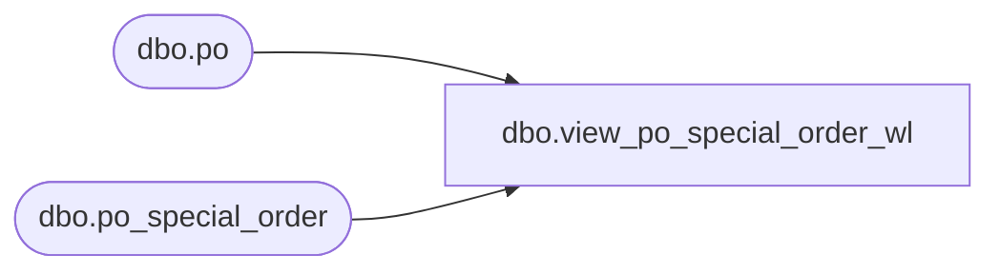

# dbo.view_po_special_order_wl

**Database:** me_01  
**Server:** bedrockdb02  

## Architecture Diagram



## Table Dependencies

| Referenced Table |
|---|
| dbo.po |
| dbo.po_special_order |

## View Code

```sql
create view dbo.view_po_special_order_wl 

AS
SELECT 	DISTINCT
	po.po_id,
	pso.po_special_order_id,
	so_number,
	customer_name 
FROM	po
LEFT OUTER JOIN po_special_order pso ON (po.po_id = pso.po_id)
```

