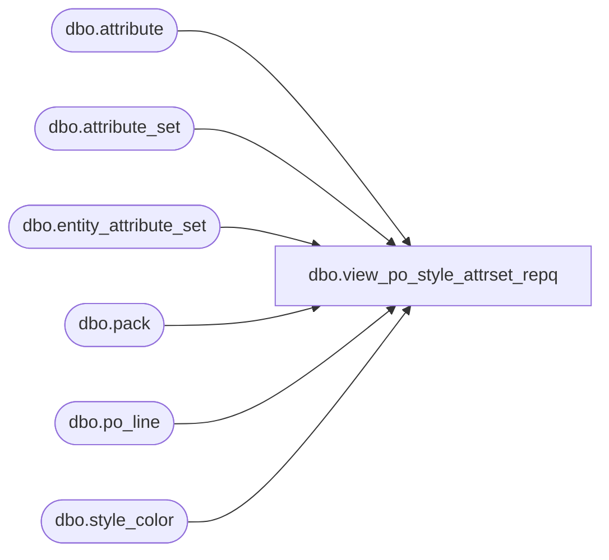

# dbo.view_po_style_attrset_repq

**Database:** me_01  
**Server:** bedrockdb02  

## Architecture Diagram



## Table Dependencies

| Referenced Table |
|---|
| dbo.attribute |
| dbo.attribute_set |
| dbo.entity_attribute_set |
| dbo.pack |
| dbo.po_line |
| dbo.style_color |

## View Code

```sql
create view dbo.view_po_style_attrset_repq 


AS
SELECT	po_id,
	a.attribute_id,
	ast.attribute_set_id,
	ast.attribute_set_code,
	a.attribute_code
FROM	po_line pl
		INNER JOIN style_color sc ON (pl.style_color_id = sc.style_color_id)
		INNER JOIN entity_attribute_set ea
		ON (ea.parent_id = sc.style_id
			AND ea.parent_type = 1)
		INNER JOIN attribute_set ast
		ON (ea.attribute_set_id = ast.attribute_set_id)
		INNER JOIN attribute a
		ON (ea.attribute_id = a.attribute_id)
WHERE	pl.style_color_id IS NOT NULL
GROUP BY po_id,
	a.attribute_id,
	ast.attribute_set_id,
	ast.attribute_set_code,
	a.attribute_code
UNION
SELECT	po_id,
	a.attribute_id,
	ast.attribute_set_id,
	ast.attribute_set_code,
	a.attribute_code
FROM	po_line pl
		INNER JOIN pack p ON (pl.pack_id = p.pack_id)
		INNER JOIN entity_attribute_set ea
		ON (ea.parent_id = p.style_id
			AND ea.parent_type = 1)
		INNER JOIN attribute_set ast
		ON (ea.attribute_set_id = ast.attribute_set_id)
		INNER JOIN attribute a
		ON (ea.attribute_id = a.attribute_id)
WHERE	pl.pack_id IS NOT NULL
GROUP BY po_id,
	a.attribute_id,
	ast.attribute_set_id,
	ast.attribute_set_code,
	a.attribute_code
```

