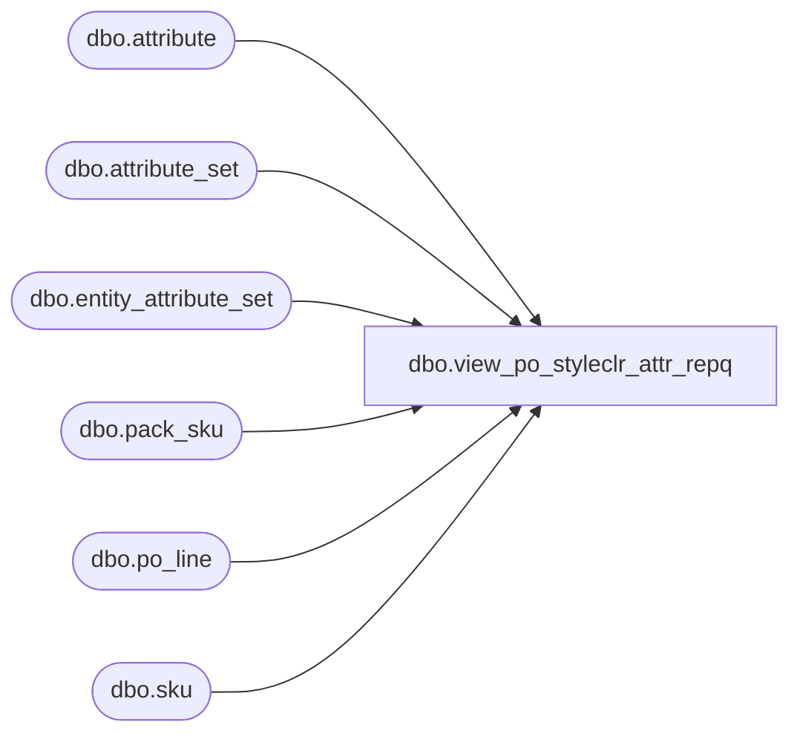

# dbo.view_po_styleclr_attr_repq

**Database:** me_01  
**Server:** bedrockdb02  

## Architecture Diagram



## Table Dependencies

| Referenced Table |
|---|
| dbo.attribute |
| dbo.attribute_set |
| dbo.entity_attribute_set |
| dbo.pack_sku |
| dbo.po_line |
| dbo.sku |

## View Code

```sql
create view dbo.view_po_styleclr_attr_repq 

AS
SELECT	po_id,
	a.attribute_id,
	ast.attribute_set_id,
	ast.attribute_set_code,
	a.attribute_code
FROM	po_line pl
		INNER JOIN entity_attribute_set ea
		ON (ea.parent_id = pl.style_color_id
			AND ea.parent_type = 19)
		INNER JOIN attribute_set ast
		ON (ea.attribute_set_id = ast.attribute_set_id)
		INNER JOIN attribute a
		ON (ea.attribute_id = a.attribute_id)
WHERE	pl.style_color_id IS NOT NULL
GROUP BY po_id,
	a.attribute_id,
	ast.attribute_set_id,
	ast.attribute_set_code,
	a.attribute_code
UNION
SELECT	po_id,
	a.attribute_id,
	ast.attribute_set_id,
	ast.attribute_set_code,
	a.attribute_code
FROM	po_line pl
		INNER JOIN pack_sku ps ON (pl.pack_id = ps.pack_id)
		INNER JOIN sku ON (sku.sku_id = ps.sku_id)
		INNER JOIN entity_attribute_set ea
		ON (ea.parent_id = sku.style_color_id
			AND ea.parent_type = 19)
		INNER JOIN attribute_set ast
		ON (ea.attribute_set_id = ast.attribute_set_id)
		INNER JOIN attribute a
		ON (ea.attribute_id = a.attribute_id)
WHERE	pl.pack_id IS NOT NULL
GROUP BY po_id,
	a.attribute_id,
	ast.attribute_set_id,
	ast.attribute_set_code,
	a.attribute_code
```

