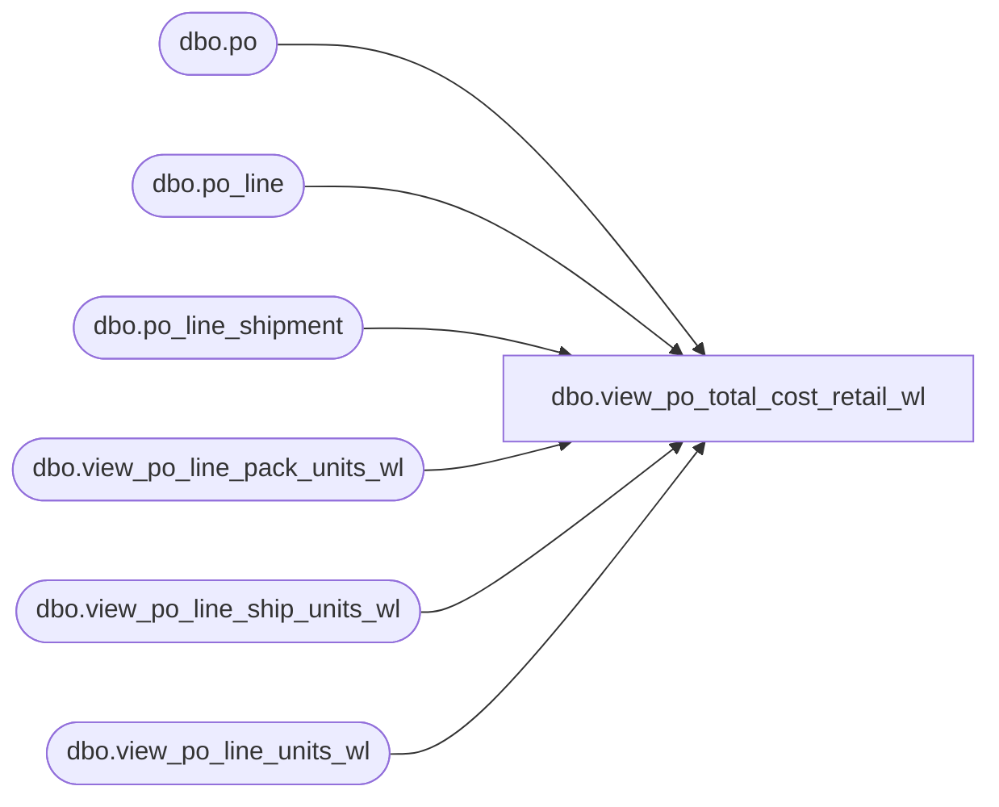

# dbo.view_po_total_cost_retail_wl

**Database:** me_01  
**Server:** bedrockdb02  

## Architecture Diagram



## Table Dependencies

| Referenced Table |
|---|
| dbo.po |
| dbo.po_line |
| dbo.po_line_shipment |
| dbo.view_po_line_pack_units_wl |
| dbo.view_po_line_ship_units_wl |
| dbo.view_po_line_units_wl |

## View Code

```sql
CREATE view [dbo].[view_po_total_cost_retail_wl] AS
SELECT
po.po_id,
SUM(CAST(round(pl.first_cost * exchange_rate,2) as decimal(14,2)) * total_units) po_total_first_cost,
SUM(CAST(round(pl.net_cost * exchange_rate,2) as decimal(14,2)) * total_units) po_total_net_cost,
SUM(pl.net_final_cost * total_units) po_total_net_final_cost,
SUM(pl.total_ordered_retail) po_total_ordered_retail,
SUM(total_units) as po_total_ordered_units,
SUM(ppl.total_pack_units) AS po_tot_order_pack_units
FROM po
LEFT OUTER JOIN po_line pl ON (po.po_id = pl.po_id)
LEFT OUTER JOIN view_po_line_units_wl lu ON (pl.po_id = lu.po_id AND pl.po_line_id = lu.po_line_id)
LEFT OUTER JOIN view_po_line_pack_units_wl ppl ON (pl.po_id = ppl.po_id AND pl.po_line_id = ppl.po_line_id)
WHERE po.line_shipment_cost_factors_flag = 0
GROUP BY po.po_id
UNION ALL
SELECT
po.po_id,
SUM(CAST(round(pl.first_cost * exchange_rate,2) as decimal(14,2)) * total_units) po_total_first_cost,
SUM(CAST(round(pl.net_cost * exchange_rate,2) as decimal(14,2)) * total_units) po_total_net_cost,
SUM(po_total_net_final_cost) po_total_net_final_cost,
SUM(pl.total_ordered_retail) po_total_ordered_retail,
SUM(total_units) as po_total_ordered_units,
SUM(total_pack_units) AS po_tot_order_pack_units
FROM po
LEFT OUTER JOIN po_line pl ON (po.po_id = pl.po_id)
LEFT OUTER JOIN

	(
		SELECT
			plsu.po_id
			,plsu.po_line_id
			,SUM(totalUnits) AS total_units
			,SUM(plsu.total_pack_units) AS total_pack_units
			,SUM(pls.net_final_cost * pls.quantity) po_total_net_final_cost
		FROM
			view_po_line_ship_units_wl plsu
			JOIN po_line_shipment pls ON pls.po_id = plsu.po_id AND pls.po_line_id = plsu.po_line_id AND pls.po_shipment_id = plsu.po_shipment_id
		GROUP BY
			plsu.po_id
			,plsu.po_line_id
	) sqR ON sqR.po_id = pl.po_id AND sqR.po_line_id = pl.po_line_id

WHERE po.line_shipment_cost_factors_flag = 1
GROUP BY po.po_id
```

