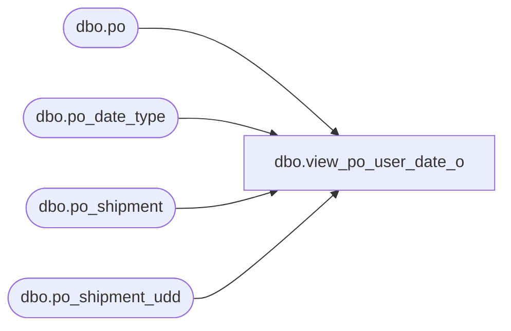

# dbo.view_po_user_date_o

**Database:** me_01  
**Server:** bedrockdb02  

## Architecture Diagram



## Table Dependencies

| Referenced Table |
|---|
| dbo.po |
| dbo.po_date_type |
| dbo.po_shipment |
| dbo.po_shipment_udd |

## View Code

```sql
CREATE  view dbo.view_po_user_date_o 
AS
SELECT po.po_id,
ps.po_shipment_id, 
psu.user_defined_date AS po_shipment_udd,
pdt.date_type_code AS date_type_code,
pdt.description AS po_date_type_description
FROM po		
LEFT OUTER JOIN po_shipment_udd psu ON (psu.po_id = po.po_id)
LEFT OUTER JOIN po_date_type pdt ON (pdt.po_date_type_id = psu.po_date_type_id)
LEFT OUTER JOIN po_shipment ps ON (ps.po_id = po.po_id )
```

