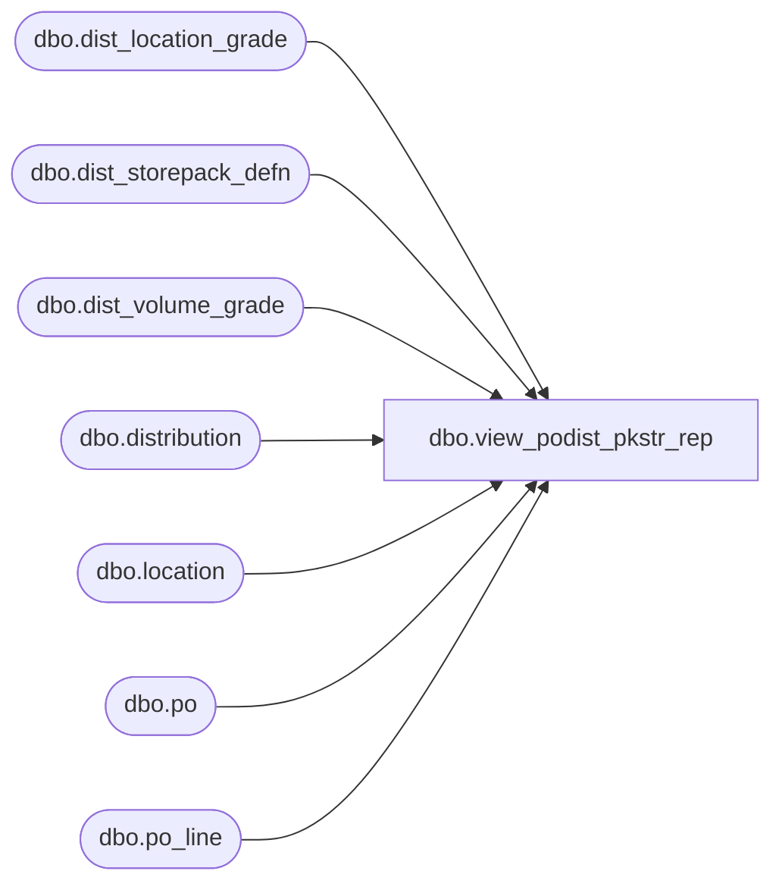

# dbo.view_podist_pkstr_rep

**Database:** me_01  
**Server:** bedrockdb02  

## Architecture Diagram



## Table Dependencies

| Referenced Table |
|---|
| dbo.dist_location_grade |
| dbo.dist_storepack_defn |
| dbo.dist_volume_grade |
| dbo.distribution |
| dbo.location |
| dbo.po |
| dbo.po_line |

## View Code

```sql
CREATE VIEW dbo.view_podist_pkstr_rep 
AS
SELECT dvg.distribution_id, d.distribution_number, d.reserve_location_id, l.location_code, l.location_name, 
d.expected_receipt_date, d.po_id, d.po_shipment_id, dvg.dist_volume_grade_id, dvg.grade_code, count (dlg.current_definition_id) grade_loc_count
FROM dist_storepack_defn dspd 
LEFT OUTER JOIN dist_location_grade dlg ON dspd.dist_storepack_definition_id = dlg.current_definition_id AND dspd.distribution_id = dlg.distribution_id
INNER JOIN dist_volume_grade dvg ON dspd.distribution_id = dvg.distribution_id AND dvg.dist_volume_grade_id = dspd.volume_grade_id
LEFT OUTER JOIN distribution d ON d.distribution_id = dvg.distribution_id
INNER JOIN po on po.po_id = d.po_id
INNER JOIN location l on l.location_id = d.reserve_location_id
WHERE d.document_source = 1
GROUP BY dvg.distribution_id, d.distribution_number, d.reserve_location_id, l.location_code, l.location_name, d.expected_receipt_date, d.po_id, d.po_shipment_id, dvg.dist_volume_grade_id, dvg.grade_code
UNION
SELECT d.distribution_id, d.distribution_number, d.reserve_location_id, l.location_code, l.location_name, d.expected_receipt_date, d.po_id, d.po_shipment_id, 0 dist_volume_grade_id, N'' grade_code, 0 grade_loc_count
FROM distribution d
INNER JOIN location l on l.location_id = d.reserve_location_id
INNER JOIN po p ON d.po_id = p.po_id and p.predistribution_type = 1
INNER JOIN po_line pl ON pl.po_id = p.po_id AND pl.store_pack_flag = 1
WHERE d.document_source = 1 AND d.distribution_method = 6
AND d.distribution_id NOT IN (SELECT distribution_id FROM dist_storepack_defn)
GROUP BY d.distribution_id, d.distribution_number, d.reserve_location_id, l.location_code, l.location_name, d.expected_receipt_date, d.po_id, d.po_shipment_id
```

