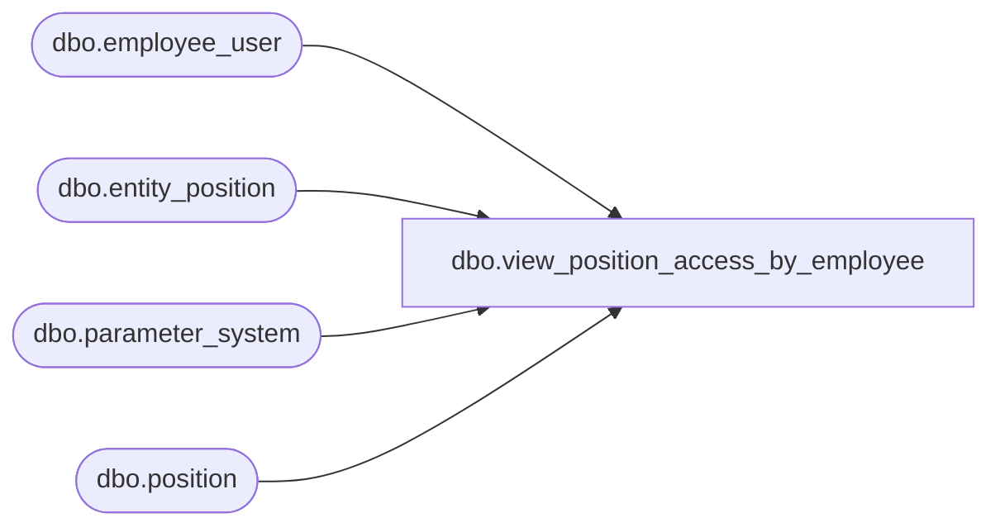

# dbo.view_position_access_by_employee

**Database:** me_01  
**Server:** bedrockdb02  

## Architecture Diagram



## Table Dependencies

| Referenced Table |
|---|
| dbo.employee_user |
| dbo.entity_position |
| dbo.parameter_system |
| dbo.position |

## View Code

```sql
CREATE  VIEW [dbo].[view_position_access_by_employee]
AS

SELECT position_id, u.[USER_ID] AS [user_id] FROM position WITH (NOLOCK), employee_user u WITH (NOLOCK)
  CROSS JOIN parameter_system WHERE restrict_by_employee_pos_flag=0

UNION ALL

SELECT  emp_ep.position_id, emp_ep.parent_id as [user_id]
FROM
  entity_position emp_ep WITH (NOLOCK)
  CROSS JOIN parameter_system ps WITH (NOLOCK)
  WHERE ps.restrict_by_employee_pos_flag=1 AND
    emp_ep.parent_type = 4 -- employee
```

