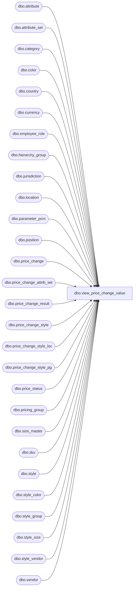

# dbo.view_price_change_value

**Database:** me_01  
**Server:** bedrockdb02  

## Architecture Diagram



## Table Dependencies

| Referenced Table |
|---|
| dbo.attribute |
| dbo.attribute_set |
| dbo.category |
| dbo.color |
| dbo.country |
| dbo.currency |
| dbo.employee_role |
| dbo.hierarchy_group |
| dbo.jurisdiction |
| dbo.location |
| dbo.parameter_pcm |
| dbo.position |
| dbo.price_change |
| dbo.price_change_attrib_set |
| dbo.price_change_result |
| dbo.price_change_style |
| dbo.price_change_style_loc |
| dbo.price_change_style_pg |
| dbo.price_status |
| dbo.pricing_group |
| dbo.size_master |
| dbo.sku |
| dbo.style |
| dbo.style_color |
| dbo.style_group |
| dbo.style_size |
| dbo.style_vendor |
| dbo.vendor |

## View Code

```sql
-----------------------------------------------------------------------------------------------------------------------------
--	Main Query: Create View
-----------------------------------------------------------------------------------------------------------------------------

CREATE VIEW dbo.view_price_change_value

AS

SELECT
	 PC.approval_status
	,PC.calculation_date
	,CAT.category_code
	,CAT.category_description
	,PCS.current_valuation_retail
	,PC.effective_from_date
	,PC.effective_to_date
	,PC.total_cost AS hdr_total_cost -- PC.total_cost used below as well
	,PC.total_affected_units AS hdr_total_units
	,PC.total_valuation_cost AS hdr_total_valuation_cost -- pc.total_valuation_cost used below as well
	,HG.hierarchy_group_code
	,HG.hierarchy_group_short_label
	,PC.issue_date
	,PC.jurisdiction_id
	,L.location_code
	,PC.location_grouping
	,L.location_id
	,L.location_name
	,(CASE
		WHEN PC.location_grouping = 1 THEN PCSL.new_price
		WHEN PC.location_grouping = 2 THEN PCSP.new_price
		ELSE PCS.new_price
		END) AS new_price
	,(CASE
		WHEN PC.location_grouping = 1 THEN PCSL.new_valuation_price
		WHEN PC.location_grouping = 2 THEN PCSP.new_valuation_price
		ELSE PCS.new_valuation_price
		END) AS new_valuation_price
	,(CASE
		WHEN PC.location_grouping = 1 THEN PCSL.old_price
		WHEN PC.location_grouping = 2 THEN PCSP.old_price
		ELSE PCS.old_price
		END) AS old_price
	,P.position_code
	,P.position_label
	,PC.price_change_description
	,PC.price_change_duration
	,PC.price_change_id
	,PC.price_change_no
	,PC.price_change_status
	,PC.price_change_type
	,PS.price_status_desc
	,PS.price_status_id
	,PG.pricing_group_code
	,PG.pricing_group_description
	,PG.pricing_group_id
	,ER.role_label
	,S.short_desc
	,S.style_code
	,(CASE
		WHEN PC.location_grouping = 1 THEN PCSL.total_cost
		WHEN PC.location_grouping = 2 THEN PCSP.total_cost
		ELSE PCS.total_cost
		END) AS total_cost
	,(CASE
		WHEN PC.location_grouping = 1 THEN PCSL.total_units
		WHEN PC.location_grouping = 2 THEN PCSP.total_units
		ELSE PCS.total_units
		END) AS total_units
	,(CASE
		WHEN PC.location_grouping = 1 THEN PCSL.total_valuation_cost
		WHEN PC.location_grouping = 2 THEN PCSP.total_valuation_cost
		ELSE PCS.total_valuation_cost
		END) AS total_valuation_cost
	,V.vendor_code
	,V.vendor_name
	,SV.vendor_style
	,PCS.style_id
	,NULL AS style_color_id
	,NULL AS color_id
	,NULL AS sku_id
	,NULL AS color_code
	,NULL AS size_code
	,PC.schema_version
	,A.attribute_code
	,ATS.attribute_set_code
	,CUR.currency_code
	,CUR.currency_description
	,CUR.currency_symbol
	,J.jurisdiction_code
	,J.jurisdiction_description
	,PS.price_status_code
	,PC.status_date
	,PC.price_change_document_type
	,PP.price_by_instruction_flag
	,NULL AS final_exception_level
	,NULL AS color_code_display
	,NULL AS color_long_description_display
	,NULL AS location_id_display
	,NULL AS location_code_display
	,NULL AS location_name_display
	,NULL AS size_code_display
	,NULL AS prim_seq_no_display
	,NULL AS sec_seq_no_display
FROM
	dbo.price_change PC
	CROSS JOIN dbo.parameter_pcm PP
	INNER JOIN dbo.jurisdiction J ON J.jurisdiction_id = PC.jurisdiction_id
	INNER JOIN dbo.country C ON C.country_id = J.country_id
	INNER JOIN dbo.currency CUR ON CUR.currency_id = C.currency_id
	INNER JOIN dbo.category CAT ON CAT.category_id = PC.category_id
	INNER JOIN dbo.position P ON P.position_id = PC.position_id
	INNER JOIN dbo.employee_role ER ON ER.employee_role_id = P.employee_role_id
	INNER JOIN dbo.price_change_style PCS ON PCS.price_change_id = PC.price_change_id
	INNER JOIN dbo.style_vendor SV ON SV.style_id = PCS.style_id
		AND SV.primary_vendor_flag = 1
	INNER JOIN dbo.vendor V ON V.vendor_id = SV.vendor_id
	INNER JOIN dbo.style S ON S.style_id = PCS.style_id
	INNER JOIN dbo.style_group SG ON SG.style_id = S.style_id
		AND SG.main_group_flag = 1
	LEFT JOIN dbo.price_status PS ON PS.price_status_id = PC.price_status_id
	LEFT JOIN dbo.price_change_attrib_set PCAS ON PCAS.price_change_id = PC.price_change_id
	LEFT JOIN dbo.attribute_set ATS ON ATS.attribute_set_id = PCAS.attribute_set_id AND ATS.attribute_id = PCAS.attribute_id
	LEFT JOIN dbo.attribute A ON A.attribute_id = ATS.attribute_id
	LEFT JOIN dbo.price_change_style_pg PCSP ON PCSP.price_change_style_id = PCS.price_change_style_id
	LEFT JOIN dbo.pricing_group PG ON PG.pricing_group_id = PCSP.pricing_group_id
	LEFT JOIN dbo.hierarchy_group HG ON HG.hierarchy_group_id = SG.hierarchy_group_id
	LEFT JOIN dbo.price_change_style_loc PCSL ON PCSL.price_change_style_id = PCS.price_change_style_id
	LEFT JOIN dbo.location L ON L.location_id = PCSL.location_id
WHERE
	PC.schema_version = 0
	AND
	(
		PC.location_grouping = 0
		OR
		(
			PC.location_grouping = 1
			AND L.location_id = PCSL.location_id
		)
		OR
		(
			PC.location_grouping = 2
			AND PG.pricing_group_id = PCSP.pricing_group_id
		)
	)

UNION ALL

SELECT
	 PC.approval_status
	,PC.calculation_date
	,CAT.category_code
	,CAT.category_description
	,PCD.current_valuation_retail_price AS current_valuation_retail
	,PC.effective_from_date
	,PC.effective_to_date
	,PC.total_cost AS hdr_total_cost
	,PC.total_affected_units AS hdr_total_units
	,PC.total_valuation_cost AS hdr_total_valuation_cost
	,HG.hierarchy_group_code
	,HG.hierarchy_group_short_label
	,PC.issue_date
	,PCD.jurisdiction_id
	,L.location_code
	,PC.location_grouping
	,L.location_id
	,L.location_name
	,PCD.selling_retail_price AS new_price
	,PCD.valuation_retail_price AS new_valuation_price
	,PCD.current_retail_price AS old_price
	,P.position_code
	,P.position_label
	,PC.price_change_description
	,PC.price_change_duration
	,PC.price_change_id
	,PC.price_change_no
	,PC.price_change_status
	,PC.price_change_type
	,PS.price_status_desc
	,PS.price_status_id
	,NULL AS pricing_group_code
	,NULL AS pricing_group_description
	,NULL AS pricing_group_id
	,ER.role_label
	,S.short_desc
	,S.style_code
	,(CASE
			WHEN PCD.is_pseudo_instruction = 0 AND PCD.total_on_hand_units IS NOT NULL AND PCD.current_retail_price <> PCD.selling_retail_price THEN PCD.total_on_hand_units
			ELSE 0
			END) * ABS(PCD.current_retail_price - PCD.selling_retail_price) AS total_cost
	,(CASE
		WHEN PCD.is_pseudo_instruction = 0 AND PCD.total_on_hand_units IS NOT NULL AND PCD.current_retail_price <> PCD.selling_retail_price THEN PCD.total_on_hand_units
		ELSE 0
		END) AS total_units
	,(CASE
		WHEN PCD.is_pseudo_instruction = 0 AND PCD.total_on_hand_units IS NOT NULL AND PCD.current_retail_price <> PCD.selling_retail_price THEN PCD.total_on_hand_units
		ELSE 0
		END) * ABS(PCD.current_valuation_retail_price - PCD.valuation_retail_price) AS total_valuation_cost
	,V.vendor_code
	,V.vendor_name
	,SV.vendor_style
	,PCD.style_id
	,SK.style_color_id
	,PCD.color_id
	,PCD.sku_id
	,CLR.color_code
	,SM.size_code
	,PC.schema_version
	,A.attribute_code
	,ATS.attribute_set_code
	,CUR.currency_code
	,CUR.currency_description
	,CUR.currency_symbol
	,J.jurisdiction_code
	,J.jurisdiction_description
	,PS.price_status_code
	,PC.status_date
	,PC.price_change_document_type
	,PP.price_by_instruction_flag
	,PCD.final_exception_level
	,(CASE
		WHEN PCD.old_exception_level IN (10, 20, 40, 50) OR PCD.final_exception_level IN (10, 20, 40, 50) THEN CLR.color_code
		ELSE NULL
		END) AS color_code_display
	,(CASE
		WHEN PCD.old_exception_level IN (10, 20, 40, 50) OR PCD.final_exception_level IN (10, 20, 40, 50) THEN CLR.color_long_description
		ELSE NULL
		END) AS color_long_description_display
	,(CASE
		WHEN PCD.old_exception_level IN (10, 20, 30) OR PCD.final_exception_level IN (10, 20, 30) THEN L.location_id
		ELSE NULL
		END) AS location_id_display
	,(CASE
		WHEN PCD.old_exception_level IN (10, 20, 30) OR PCD.final_exception_level IN (10, 20, 30) THEN L.location_code
		ELSE NULL
		END) AS location_code_display
	,(CASE
		WHEN PCD.old_exception_level IN (10, 20, 30) OR PCD.final_exception_level IN (10, 20, 30) THEN L.location_name
		ELSE NULL
		END) AS location_name_display
	,(CASE
		WHEN PCD.old_exception_level IN (10, 40) OR PCD.final_exception_level IN (10, 40) THEN SM.size_code
		ELSE NULL
		END) AS size_code_display
	,(CASE
		WHEN PCD.old_exception_level IN (10, 40) OR PCD.final_exception_level IN (10, 40) THEN SM.prim_seq_no
		ELSE NULL
		END) AS prim_seq_no_display
	,(CASE
		WHEN PCD.old_exception_level IN (10, 40) OR PCD.final_exception_level IN (10, 40) THEN SM.sec_seq_no
		ELSE NULL
		END) AS seq_seq_no_display

FROM
	dbo.price_change PC
	CROSS JOIN dbo.parameter_pcm PP
	INNER JOIN dbo.category CAT ON CAT.category_id = PC.category_id
	INNER JOIN dbo.position P ON P.position_id = PC.position_id
	INNER JOIN dbo.employee_role ER ON ER.employee_role_id = P.employee_role_id
	INNER JOIN dbo.price_change_result PCD ON PCD.result_id = PC.result_id
	INNER JOIN dbo.jurisdiction J ON J.jurisdiction_id = PCD.jurisdiction_id
	INNER JOIN dbo.country C ON C.country_id = J.country_id
	INNER JOIN dbo.currency CUR ON CUR.currency_id = C.currency_id
	INNER JOIN dbo.style_vendor SV ON SV.style_id = PCD.style_id
		AND SV.primary_vendor_flag = 1
	INNER JOIN dbo.vendor V ON V.vendor_id = SV.vendor_id
	INNER JOIN dbo.style S ON S.style_id = PCD.style_id
	INNER JOIN dbo.style_group SG ON SG.style_id = S.style_id
		AND SG.main_group_flag = 1
	LEFT JOIN dbo.price_status PS ON PS.price_status_id = PC.price_status_id
	LEFT JOIN dbo.price_change_attrib_set PCAS ON PCAS.price_change_id = PC.price_change_id
	LEFT JOIN dbo.attribute_set ATS ON ATS.attribute_set_id = PCAS.attribute_set_id AND ATS.attribute_id = PCAS.attribute_id
	LEFT JOIN dbo.attribute A ON A.attribute_id = ATS.attribute_id
	LEFT JOIN dbo.hierarchy_group HG ON HG.hierarchy_group_id = SG.hierarchy_group_id
	LEFT JOIN dbo.location L ON L.location_id = PCD.location_id
	LEFT JOIN dbo.sku SK ON SK.sku_id = PCD.sku_id
	LEFT JOIN dbo.style_color SC ON SC.style_color_id = SK.style_color_id
	LEFT JOIN dbo.color CLR ON CLR.color_id = SC.color_id
	LEFT JOIN dbo.style_size SS ON SS.style_size_id = SK.style_size_id
	LEFT JOIN dbo.size_master SM ON SM.size_master_id = SS.size_master_id

WHERE
	PC.schema_version = 1
```

