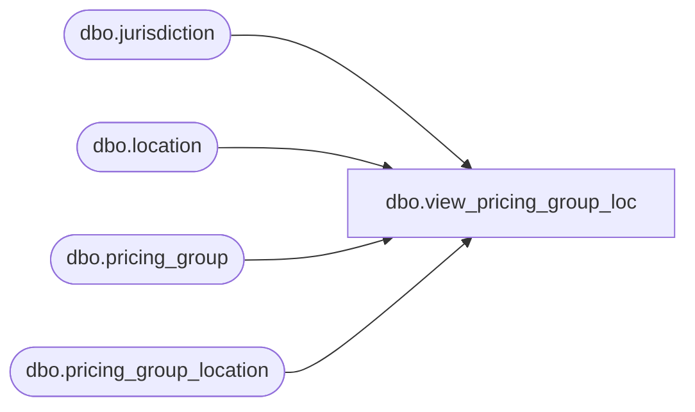

# dbo.view_pricing_group_loc

**Database:** me_01  
**Server:** bedrockdb02  

## Architecture Diagram



## Table Dependencies

| Referenced Table |
|---|
| dbo.jurisdiction |
| dbo.location |
| dbo.pricing_group |
| dbo.pricing_group_location |

## View Code

```sql
CREATE VIEW dbo.view_pricing_group_loc
AS
select pl.pricing_group_id, pl.location_id, j.jurisdiction_id
from pricing_group_location pl, location l, jurisdiction j, pricing_group pg
where pl.location_id = l.location_id
and pl.pricing_group_id = pg.pricing_group_id
and pg.jurisdiction_id = l.jurisdiction_id
and l.jurisdiction_id = j.jurisdiction_id
```

