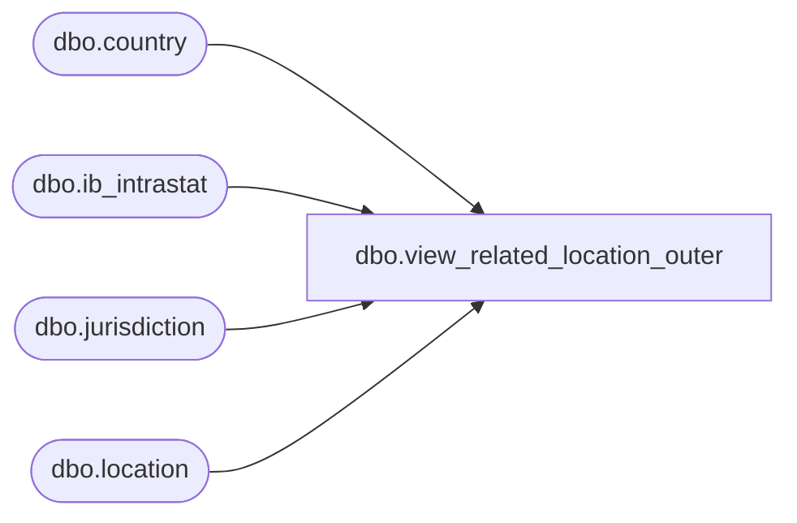

# dbo.view_related_location_outer

**Database:** me_01  
**Server:** bedrockdb02  

## Architecture Diagram



## Table Dependencies

| Referenced Table |
|---|
| dbo.country |
| dbo.ib_intrastat |
| dbo.jurisdiction |
| dbo.location |

## View Code

```sql
create view dbo.view_related_location_outer AS
SELECT DISTINCT
 i.ib_intrastat_id,
 l.location_id, 
 l.location_code,
 l.location_name,
 l.tax_registration_number1, 
 l.tax_registration_number2,
 c.country_id,
 c.country_code,
 c.country_description
FROM location l
RIGHT OUTER JOIN ib_intrastat i
ON  i.other_location_id =l.location_id 
LEFT OUTER JOIN jurisdiction j
ON l.jurisdiction_id = j.jurisdiction_id
LEFT OUTER JOIN country c
on j.country_id = c.country_id


dbo,view_relative_merch_week,CREATE VIEW dbo.view_relative_merch_week AS 
	SELECT a.year_week, COUNT(b.year_week) relative_position 
	FROM (SELECT DISTINCT (cd1.merch_year * 100 + cd1.merch_week) year_week 
			FROM dbo.calendar_date cd1
			WHERE cd1.calendar_date <= GETDATE()) a, 
		(SELECT DISTINCT (cd2.merch_year * 100 + cd2.merch_week) year_week 
			FROM dbo.calendar_date cd2
			WHERE cd2.calendar_date <= GETDATE()) b 
	WHERE b.year_week <= a.year_week 
	GROUP BY a.year_week
```

