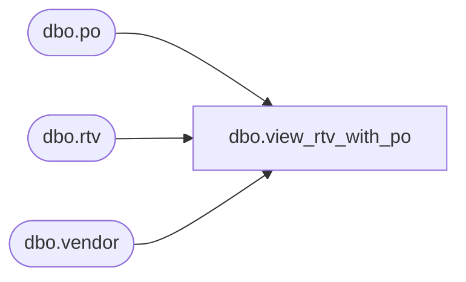

# dbo.view_rtv_with_po

**Database:** me_01  
**Server:** bedrockdb02  

## Architecture Diagram



## Table Dependencies

| Referenced Table |
|---|
| dbo.po |
| dbo.rtv |
| dbo.vendor |

## View Code

```sql
create view dbo.view_rtv_with_po       (doc_type,
       doc_no,
       from_location_id,
       to_location_id,
       create_date,
       receive_date,
       status,
       description,
       doc_id,
       display_location_id,
       grouping_label,
       secondary_type,
       vendor_code,
       vendor_name,
       transaction_reason_id,
       packed_by,
       ship_date,
       print_flag,
       return_authorization_no,
       rtv_acknowledgement_req_flag,
       match_status,
       po_no,
       document_source)
AS
SELECT N'RTV',
      rtv.document_no,
      rtv.location_id,
      CAST(null AS smallint),
      convert(smalldatetime,convert(char(12),rtv.create_date,109)),
      convert(smalldatetime,convert(char(12),rtv.returned_date,109)),
      rtv.document_status,
      rtv.document_description,
      rtv_id,
      rtv.location_id,
      rtv.grouping_label,
      0,
      vendor.vendor_code,
      vendor.vendor_name,
      rtv.transaction_reason_id,
      rtv.packed_by,
      CAST(null AS smalldatetime),
      rtv.print_flag,
      rtv.return_authorization_no,
      vendor.rtv_acknowledgement_req_flag,
      rtv.match_status,
      po.po_no,
      rtv.document_source
FROM dbo.rtv,dbo.vendor,dbo.po
WHERE rtv.vendor_id = vendor.vendor_id    
AND rtv.po_id=po.po_id
AND rtv.po_id IS NOT NULL
```

