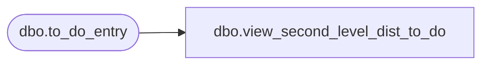

# dbo.view_second_level_dist_to_do

**Database:** me_01  
**Server:** bedrockdb02  

## Architecture Diagram



## Table Dependencies

| Referenced Table |
|---|
| dbo.to_do_entry |

## View Code

```sql
create view dbo.view_second_level_dist_to_do AS
SELECT to_do_entry_id, CAST(0 as bit) second_level_distribution 
FROM to_do_entry
WHERE parent_distribution_id IS NULL
AND distribution_id IS NULL
UNION ALL
SELECT to_do_entry_id, CAST(1 as bit)  second_level_distribution 
FROM to_do_entry
WHERE parent_distribution_id IS NOT NULL
AND  distribution_id IS NULL
```

