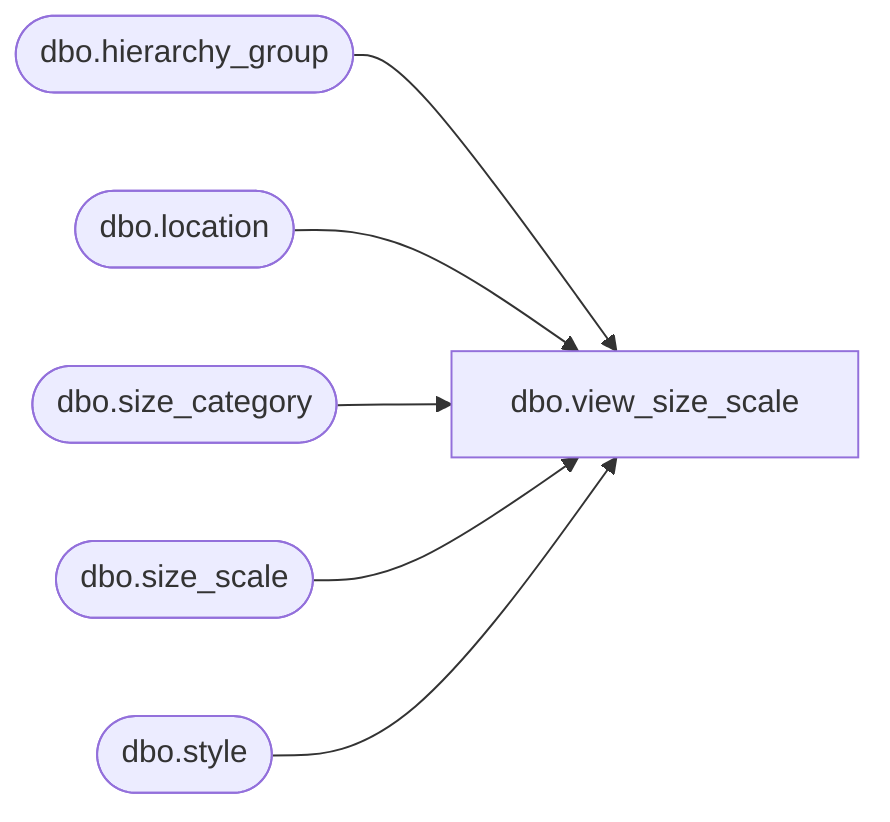

# dbo.view_size_scale

**Database:** me_01  
**Server:** bedrockdb02  

## Architecture Diagram



## Table Dependencies

| Referenced Table |
|---|
| dbo.hierarchy_group |
| dbo.location |
| dbo.size_category |
| dbo.size_scale |
| dbo.style |

## View Code

```sql
create view dbo.view_size_scale as
select ss.size_scale_id, ss.hierarchy_group_id,h.hierarchy_group_code, h.hierarchy_group_label,
h.hierarchy_group_short_label, NULL style_id, NULL style_code, NULL long_desc,
NULL short_desc,ISNULL (ss.location_id,-1)location_id, ISNULL(l.location_code,-1)location_code,
ISNULL(l.location_name,-1)location_name,ISNULL(l.location_short_name,-1)location_short_name, ISNULL(sc.size_category_id,-1)size_category_id,
ISNULL(sc.size_category_code,-1)size_category_code, ISNULL(sc.size_category_label,-1)size_category_label,
ss.merch_level, ss.size_scale_type,ss.scale_type,ss.allow_system_override_flag,ss.size_scale_total,
ss.source,ss.last_activity_date 
from size_scale ss
 inner join hierarchy_group h
 on ss.hierarchy_group_id = h.hierarchy_group_id
left outer join location l
on ss.location_id =l.location_id
left outer join size_category sc
on ss.size_category_id = sc.size_category_id
union all
select ss.size_scale_id, NULL hierarchy_group_id,NULL hierarchy_group_code, NULL hierarchy_group_label,
NULL hierarchy_group_short_label, ss.style_id,s.style_code, s.long_desc,
s.short_desc,ISNULL (ss.location_id,-1)location_id, ISNULL(l.location_code,-1)location_code,
ISNULL(l.location_name,-1)location_name,ISNULL(l.location_short_name,-1)location_short_name, ISNULL(sc.size_category_id,-1)size_category_id,
ISNULL(sc.size_category_code,-1)size_category_code, ISNULL(sc.size_category_label,-1)size_category_label,
ss.merch_level, ss.size_scale_type,ss.scale_type,ss.allow_system_override_flag,ss.size_scale_total,
ss.source,ss.last_activity_date 
from size_scale ss
 inner join style s
 on ss.style_id = s.style_id
left outer join location l
on ss.location_id =l.location_id
left outer join size_category sc
on ss.size_category_id = sc.size_category_id
```

