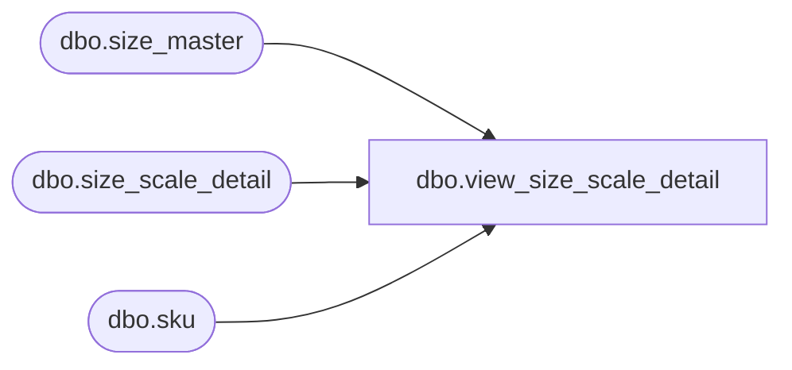

# dbo.view_size_scale_detail

**Database:** me_01  
**Server:** bedrockdb02  

## Architecture Diagram



## Table Dependencies

| Referenced Table |
|---|
| dbo.size_master |
| dbo.size_scale_detail |
| dbo.sku |

## View Code

```sql
create view dbo.view_size_scale_detail as
select ssd.size_scale_id,ssd.size_master_id,ssd.sku_id,ssd.scale_qty, sk.style_id,
sm.size_category_id,sm.prim_size_label,sm.sec_size_label,sm.size_code
from size_scale_detail ssd
left outer join sku sk
on ssd.sku_id = sk.sku_id
left outer join size_master sm
on  ssd.size_master_id = sm.size_master_id
```

