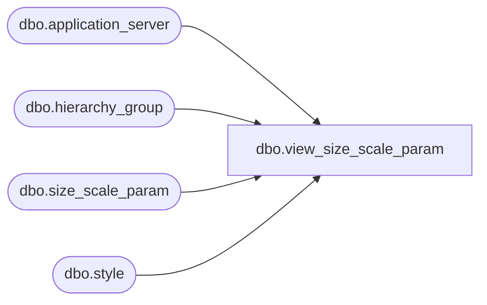

# dbo.view_size_scale_param

**Database:** me_01  
**Server:** bedrockdb02  

## Architecture Diagram



## Table Dependencies

| Referenced Table |
|---|
| dbo.application_server |
| dbo.hierarchy_group |
| dbo.size_scale_param |
| dbo.style |

## View Code

```sql
create view dbo.view_size_scale_param  AS
(SELECT DISTINCT
 sp.size_scale_param_id,
 NULL merchandise_hierarchy_group_id,
 NULL hierarchy_group_code,
 NULL hierarchy_group_short_label,
 NULL hierarchy_group_label,
 sp.style_id,
 s.style_code,
 s.short_desc,
 s.long_desc,
 sp.review_on_sunday,
 sp.review_on_monday,
 sp.review_on_tuesday,
 sp.review_on_wednesday,
 sp.review_on_thursday,
 sp.review_on_friday,
 sp.review_on_saturday,
 sp.cycle_frequency,
 convert(smalldatetime,convert(char(12),
 sp.last_execution,109))last_execution,
 convert(smalldatetime,convert(char(12),
 sp.next_execution,109))next_execution,
 sp.cycle_period,
 sp.merch_year_week_from,
 sp.merch_year_week_to,
 sp.last_number_of_weeks,
 sp.at_merch_group_level_flag,
 sp.at_style_size_level_flag,
 sp.at_style_color_size_level_flag,
 sp.chain_level_flag,
 convert(smalldatetime,convert(char(12),
 sp.last_modified_date,109))last_modified_date,
 ap.server_name
FROM size_scale_param sp
INNER JOIN style s
ON sp.style_id = s.style_id
INNER JOIN application_server ap
ON sp.application_server_id = ap.application_server_id
)
UNION ALL
(SELECT DISTINCT
 sp.size_scale_param_id,
 sp.hierarchy_group_id,
 h.hierarchy_group_code,
 h.hierarchy_group_short_label,
 h.hierarchy_group_label, 
 NULL style_id,
 NULL style_code,
 NULL short_desc,
 NULL long_desc,
 sp.review_on_sunday,
 sp.review_on_monday,
 sp.review_on_tuesday,
 sp.review_on_wednesday,
 sp.review_on_thursday,
 sp.review_on_friday,
 sp.review_on_saturday,
 sp.cycle_frequency,
  convert(smalldatetime,convert(char(12),
 sp.last_execution,109))last_execution,
 convert(smalldatetime,convert(char(12),
 sp.next_execution,109))next_execution,
 sp.cycle_period,
 sp.merch_year_week_from,
 sp.merch_year_week_to,
 sp.last_number_of_weeks,
 sp.at_merch_group_level_flag,
 sp.at_style_size_level_flag,
 sp.at_style_color_size_level_flag,
 sp.chain_level_flag,
 convert(smalldatetime,convert(char(12),
 sp.last_modified_date,109))last_modified_date,
 ap.server_name
 FROM size_scale_param sp
 INNER JOIN hierarchy_group h
 ON sp.hierarchy_group_id = h.hierarchy_group_id
 INNER JOIN application_server ap
 ON sp.application_server_id = ap.application_server_id
)
```

