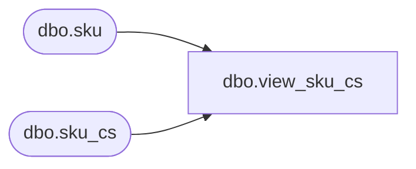

# dbo.view_sku_cs

**Database:** me_01  
**Server:** bedrockdb02  

## Architecture Diagram



## Table Dependencies

| Referenced Table |
|---|
| dbo.sku |
| dbo.sku_cs |

## View Code

```sql
create view dbo.view_sku_cs 
AS
SELECT [sku_id]
      ,[style_id]
      ,[style_color_id]
      ,[style_size_id]
      ,[bin_location]
  FROM [sku]
UNION ALL
SELECT [sku_id]
      ,[style_id]
      ,[style_color_id]
      ,[style_size_id]
      ,[bin_location]
  FROM [sku_cs]
```

