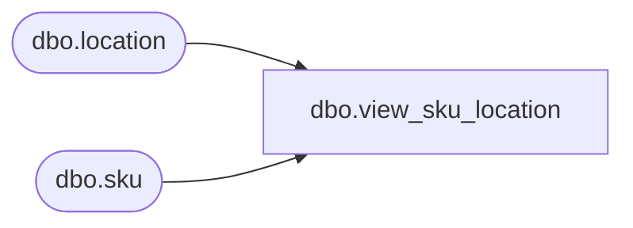

# dbo.view_sku_location

**Database:** me_01  
**Server:** bedrockdb02  

## Architecture Diagram



## Table Dependencies

| Referenced Table |
|---|
| dbo.location |
| dbo.sku |

## View Code

```sql
create view dbo.view_sku_location 
         (sku_id,
          style_id,
          location_id)
AS
   SELECT sk.sku_id,
          sk.style_id,
          l.location_id
     FROM sku sk,
          location l
```

