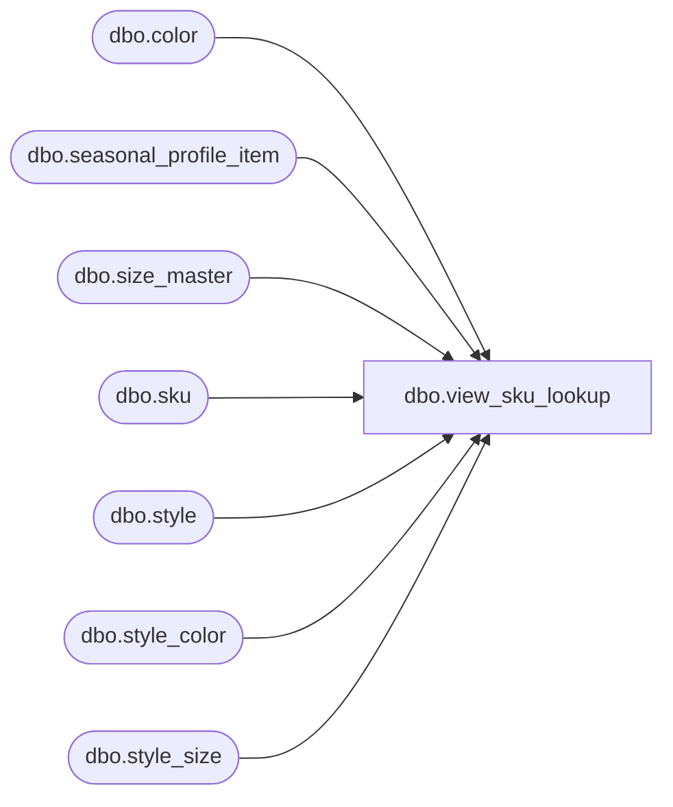

# dbo.view_sku_lookup

**Database:** me_01  
**Server:** bedrockdb02  

## Architecture Diagram



## Table Dependencies

| Referenced Table |
|---|
| dbo.color |
| dbo.seasonal_profile_item |
| dbo.size_master |
| dbo.sku |
| dbo.style |
| dbo.style_color |
| dbo.style_size |

## View Code

```sql
create view dbo.view_sku_lookup AS
SELECT sk.sku_id, s.style_code + N' - ' + s.short_desc + N' - '+ c.color_code + N' ' + sm.size_code 'sku_label'
FROM sku sk
INNER JOIN style s ON (s.style_id = sk.style_id)
INNER JOIN style_color sc ON (sc.style_color_id =sk.style_color_id)
INNER JOIN style_size ss ON (ss.style_size_id = sk.style_size_id)
INNER JOIN color c ON (sc.color_id = c.color_id)
INNER JOIN size_master sm ON (ss.size_master_id = sm.size_master_id)
WHERE sk.sku_id not in (select distinct ISNULL(sku_id,0) from seasonal_profile_item)
```

