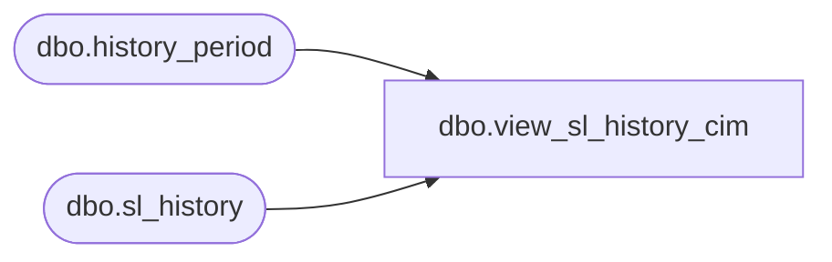

# dbo.view_sl_history_cim

**Database:** me_01  
**Server:** bedrockdb02  

## Architecture Diagram



## Table Dependencies

| Referenced Table |
|---|
| dbo.history_period |
| dbo.sl_history |

## View Code

```sql
create view dbo.view_sl_history_cim 
       ( hierarchy_group_id, 
	 history_period_id,
         calendar_period_id, 
         location_id, 
         sl_component_id, 
         history_value,
	 history_value_local) 
AS 
SELECT merch_hierarchy_group_id, 
h.history_period_id,
hp.calendar_period_id, 
h.location_id, 
h.sl_component_id, 
h.history_value,
h.history_value_local
FROM sl_history h, history_period hp  
WHERE h.history_period_id = hp.history_period_id
```

