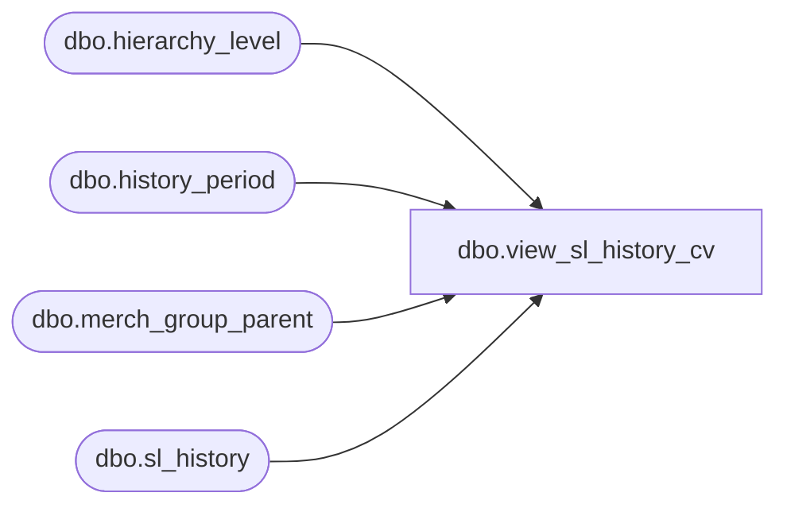

# dbo.view_sl_history_cv

**Database:** me_01  
**Server:** bedrockdb02  

## Architecture Diagram



## Table Dependencies

| Referenced Table |
|---|
| dbo.hierarchy_level |
| dbo.history_period |
| dbo.merch_group_parent |
| dbo.sl_history |

## View Code

```sql
create view dbo.view_sl_history_cv ( hierarchy_group_id, history_period_id, 
calendar_period_id, location_id, 
sl_component_id, history_value, history_value_local) 
as 
select mgp.parent_hierarchy_group_id hierarchy_group_id, h.history_period_id,
hp.calendar_period_id, h.location_id, h.sl_component_id, 
sum(h.history_value) history_value, sum(h.history_value_local) history_value_local  
from sl_history h, merch_group_parent mgp, history_period hp  
where h.merch_hierarchy_group_id = mgp.hierarchy_group_id 
and mgp.hierarchy_level_id = (select max(hierarchy_level_id) from hierarchy_level where hierarchy_id =1) 
and h.history_period_id = hp.history_period_id  
group by mgp.parent_hierarchy_group_id, h.history_period_id,
hp.calendar_period_id, h.location_id, h.sl_component_id
```

