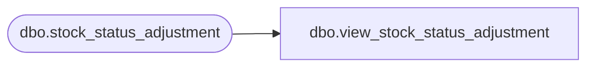

# dbo.view_stock_status_adjustment

**Database:** me_01  
**Server:** bedrockdb02  

## Architecture Diagram



## Table Dependencies

| Referenced Table |
|---|
| dbo.stock_status_adjustment |

## View Code

```sql
create view dbo.view_stock_status_adjustment 
         (doc_type,
          doc_no,
          create_date,
          status,
          doc_id,
          grouping_label,
          transaction_reason_id,
          performed_by)
AS
   SELECT N'Stock status adjustment',
          document_no,
	  convert(smalldatetime,convert(char(12),create_date,109)),
          document_status,
          stock_status_adjustment_id,
          grouping_label,
          CAST(null AS smallint),
          performed_by
     FROM dbo.stock_status_adjustment
```

