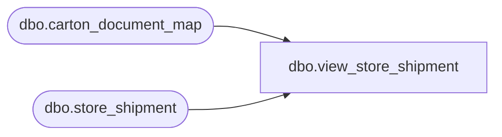

# dbo.view_store_shipment

**Database:** me_01  
**Server:** bedrockdb02  

## Architecture Diagram



## Table Dependencies

| Referenced Table |
|---|
| dbo.carton_document_map |
| dbo.store_shipment |

## View Code

```sql
create view dbo.view_store_shipment 
         (doc_type,
          doc_no,
          from_location_id,
          to_location_id,
          create_date,
          receive_date,
          status,
          description,
          doc_id,
          display_location_id,
          grouping_label,
          secondary_type,
          vendor_code,
          vendor_name,
          transaction_reason_id,
          performed_by,
          cartons_arrived, 
          total_cartons,
          match_status,
          shipment_ref_no)
AS
   SELECT N'Store shipment',
          document_no,
          from_location_id,
          location_id,
	  convert(smalldatetime,convert(char(12),create_date,109)),
	  convert(smalldatetime,convert(char(12),receive_date,109)),
          document_status,
          CAST(null AS nvarchar(60)),
          store_shipment_id,
          location_id,
          CAST(null AS nvarchar(20)),
          0,
          CAST(null AS nvarchar(20)),
          CAST(null AS nvarchar(50)),
          CAST(null AS smallint),
          performed_by,
          (select count(*) from carton_document_map 
		where document_type = 2 
		  and document_id = store_shipment_id 
		  and carton_arrived_flag = 1),
            (select count(*) from carton_document_map 
		where document_type = 2 
		  and document_id = store_shipment_id),
           CAST(null AS smallint),
           CAST(null AS nvarchar(30))
     FROM dbo.store_shipment
```

