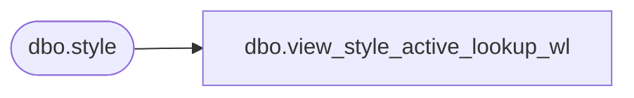

# dbo.view_style_active_lookup_wl

**Database:** me_01  
**Server:** bedrockdb02  

## Architecture Diagram



## Table Dependencies

| Referenced Table |
|---|
| dbo.style |

## View Code

```sql
create view dbo.view_style_active_lookup_wl AS
SELECT     style_id, style_code + N' - ' + long_desc AS style_label
FROM         dbo.style
WHERE     (active_flag = 1)
```

