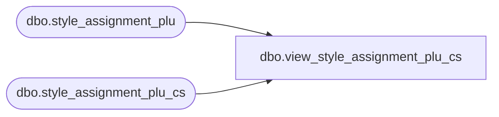

# dbo.view_style_assignment_plu_cs

**Database:** me_01  
**Server:** bedrockdb02  

## Architecture Diagram



## Table Dependencies

| Referenced Table |
|---|
| dbo.style_assignment_plu |
| dbo.style_assignment_plu_cs |

## View Code

```sql
create view dbo.view_style_assignment_plu_cs 
AS
SELECT [style_assignment_plu_id]
      ,[style_id]
      ,[parameter_group_plu_id]
      ,[attribute_set_id]
      ,[location_id]
      ,[group_permutation_plu_id]
      ,[style_size_id]
  FROM [style_assignment_plu]
UNION ALL
SELECT [style_assignment_plu_id]
      ,[style_id]
      ,[parameter_group_plu_id]
      ,[attribute_set_id]
      ,[location_id]
      ,[group_permutation_plu_id]
      ,[style_size_id]
  FROM [style_assignment_plu_cs]
```

