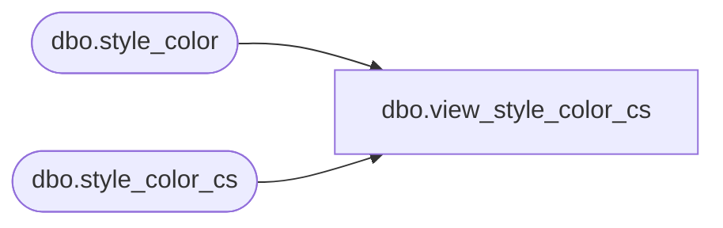

# dbo.view_style_color_cs

**Database:** me_01  
**Server:** bedrockdb02  

## Architecture Diagram



## Table Dependencies

| Referenced Table |
|---|
| dbo.style_color |
| dbo.style_color_cs |

## View Code

```sql
create view dbo.view_style_color_cs 
AS
SELECT [style_color_id]
      ,[style_id]
      ,[color_id]
      ,[long_desc]
      ,[short_desc]
      ,[fashion_flag]
      ,[reorder_flag]
      ,[attachment_url]
      ,[red_value]
      ,[green_value]
      ,[blue_value]
  FROM [style_color]
UNION ALL
SELECT [style_color_id]
      ,[style_id]
      ,[color_id]
      ,[long_desc]
      ,[short_desc]
      ,[fashion_flag]
      ,[reorder_flag]
      ,[attachment_url]
      ,[red_value]
      ,[green_value]
      ,[blue_value]
  FROM [style_color_cs]
```

