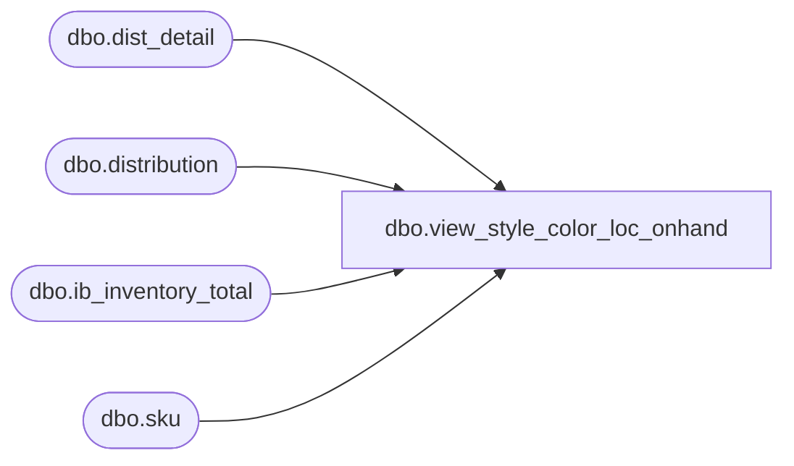

# dbo.view_style_color_loc_onhand

**Database:** me_01  
**Server:** bedrockdb02  

## Architecture Diagram



## Table Dependencies

| Referenced Table |
|---|
| dbo.dist_detail |
| dbo.distribution |
| dbo.ib_inventory_total |
| dbo.sku |

## View Code

```sql
create view dbo.view_style_color_loc_onhand 
AS
SELECT a.style_color_id, a.location_id, a.available_quantity-b.allocated_quantity on_hand
FROM
(	SELECT sku.style_color_id, ib.location_id, SUM(ib.total_on_hand_units) available_quantity
	FROM ib_inventory_total ib 
	INNER JOIN sku ON (ib.sku_id = sku.sku_id)
	WHERE ib.inventory_status_id = 1 
	GROUP BY sku.style_color_id, ib.location_id
) a INNER JOIN
(	SELECT sku.style_color_id, d.location_id, sum(dd.quantity) allocated_quantity
	FROM dist_detail dd
	INNER JOIN sku ON (dd.sku_id = sku.sku_id)
	INNER JOIN distribution d ON (dd.distribution_id = d.distribution_id)
	WHERE  d.distribution_status in (5,6,7) 
	GROUP BY sku.style_color_id, d.location_id
) b ON (a.style_color_id = b.style_color_id AND a.location_id = b.location_id)
```

