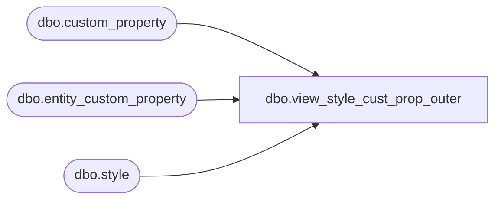

# dbo.view_style_cust_prop_outer

**Database:** me_01  
**Server:** bedrockdb02  

## Architecture Diagram



## Table Dependencies

| Referenced Table |
|---|
| dbo.custom_property |
| dbo.entity_custom_property |
| dbo.style |

## View Code

```sql
create view dbo.view_style_cust_prop_outer 
AS
SELECT g.style_id,f.custom_property_value,{fn IFNULL(g.custom_property_id ,-1)} custom_property_id,
g.cust_prop_code, g.cust_prop_label
FROM (  SELECT DISTINCT a.style_id,  
                        e.custom_property_value,   
                       e.custom_property_id 
        FROM entity_custom_property e RIGHT JOIN style a 
        ON a.style_id =e.parent_id and e.parent_type =1
        LEFT JOIN   custom_property b 
        ON e.custom_property_id = b.custom_property_id ) f
RIGHT JOIN
     (  SELECT DISTINCT a.style_id, 
                        NULL custom_property_value,
                        e.custom_property_id,
                        e.cust_prop_code,
                        e.cust_prop_label
        FROM custom_property e ,style a
        WHERE e.entity_type=1) g
on
 f.style_id = g.style_id
AND (f.custom_property_id = g.custom_property_id
OR f.custom_property_id is NULL)
```

