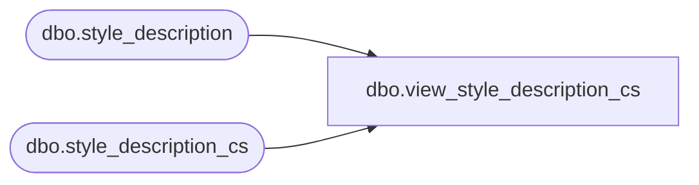

# dbo.view_style_description_cs

**Database:** me_01  
**Server:** bedrockdb02  

## Architecture Diagram



## Table Dependencies

| Referenced Table |
|---|
| dbo.style_description |
| dbo.style_description_cs |

## View Code

```sql
create view dbo.view_style_description_cs 
AS
SELECT [style_description_id]
      ,[style_id]
      ,[language_id]
      ,[long_desc]
      ,[short_desc]
      ,[plu_desc]
  FROM [style_description]
UNION ALL
SELECT [style_description_id]
      ,[style_id]
      ,[language_id]
      ,[long_desc]
      ,[short_desc]
      ,[plu_desc]
  FROM [style_description_cs]
```

