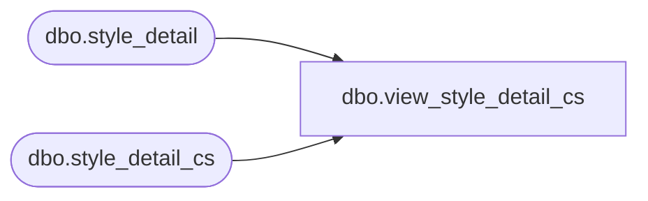

# dbo.view_style_detail_cs

**Database:** me_01  
**Server:** bedrockdb02  

## Architecture Diagram



## Table Dependencies

| Referenced Table |
|---|
| dbo.style_detail |
| dbo.style_detail_cs |

## View Code

```sql
create view dbo.view_style_detail_cs 
AS
SELECT [style_detail_id]
      ,[style_id]
      ,[last_receipt_date]
      ,[total_inventory_units]
      ,[last_net_po_cost]
      ,[last_net_final_po_cost]
      ,[mix_match_rule_flag]
      ,[updatestamp]
  FROM [style_detail]
UNION ALL
SELECT [style_detail_id]
      ,[style_id]
      ,[last_receipt_date]
      ,[total_inventory_units]
      ,[last_net_po_cost]
      ,[last_net_final_po_cost]
      ,[mix_match_rule_flag]
      ,[updatestamp]
  FROM [style_detail_cs]
```

