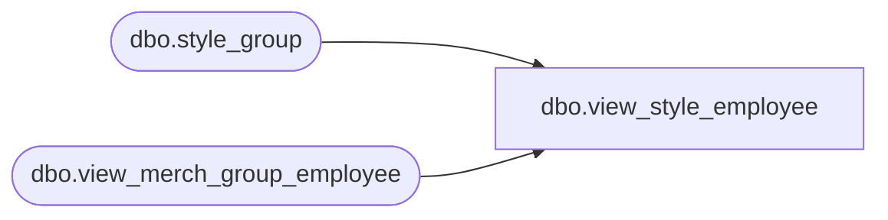

# dbo.view_style_employee

**Database:** me_01  
**Server:** bedrockdb02  

## Architecture Diagram



## Table Dependencies

| Referenced Table |
|---|
| dbo.style_group |
| dbo.view_merch_group_employee |

## View Code

```sql
CREATE  VIEW [dbo].view_style_employee
AS

SELECT sg.style_id, v.[user_id]
FROM [view_merch_group_employee] v
INNER JOIN style_group sg ON v.hierarchy_group_id = sg.hierarchy_group_id AND sg.main_group_flag =1
```

