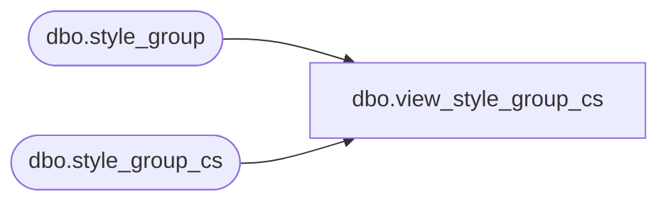

# dbo.view_style_group_cs

**Database:** me_01  
**Server:** bedrockdb02  

## Architecture Diagram



## Table Dependencies

| Referenced Table |
|---|
| dbo.style_group |
| dbo.style_group_cs |

## View Code

```sql
create view dbo.view_style_group_cs 
AS
SELECT [style_group_id]
      ,[hierarchy_group_id]
      ,[style_id]
      ,[main_group_flag]
      ,[reclass_pending_flag]
      ,[reclass_to_group_id]
      ,[reclass_move_history_flag]
  FROM [style_group]
UNION ALL
SELECT [style_group_id]
      ,[hierarchy_group_id]
      ,[style_id]
      ,[main_group_flag]
      ,[reclass_pending_flag]
      ,[reclass_to_group_id]
      ,[reclass_move_history_flag]
  FROM [style_group_cs]

dbo,view_style_grp_reclass_group,-----------------------------------------------------------------------------------------------------------------------------
--	Main Query: Create View
-----------------------------------------------------------------------------------------------------------------------------
CREATE VIEW dbo.view_style_grp_reclass_group
AS
SELECT sg.style_group_id, sg.style_id, sg.hierarchy_group_id, sg.reclass_pending_flag, sg.reclass_move_history_flag, sg.reclass_to_group_id, hg.hierarchy_group_code, hg.hierarchy_group_label
FROM style_group sg
LEFT JOIN hierarchy_group hg ON sg.reclass_to_group_id = hg.hierarchy_group_id
```

