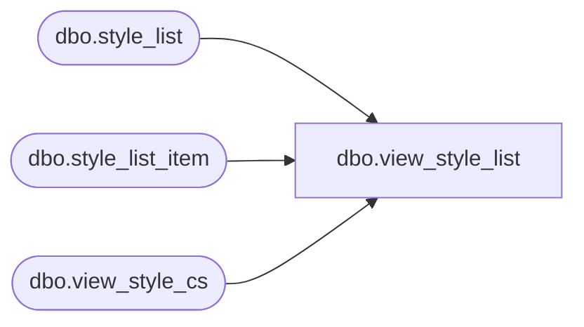

# dbo.view_style_list

**Database:** me_01  
**Server:** bedrockdb02  

## Architecture Diagram



## Table Dependencies

| Referenced Table |
|---|
| dbo.style_list |
| dbo.style_list_item |
| dbo.view_style_cs |

## View Code

```sql
create view dbo.view_style_list 
AS
SELECT s.style_id, sl.style_list_id, sl.style_list_name 
FROM style_list_item sli
RIGHT OUTER JOIN view_style_cs  s on sli.style_id = s.style_id
LEFT OUTER JOIN style_list sl on sl.style_list_id = sli.style_list_id
```

