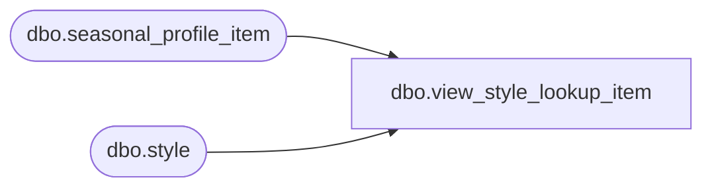

# dbo.view_style_lookup_item

**Database:** me_01  
**Server:** bedrockdb02  

## Architecture Diagram



## Table Dependencies

| Referenced Table |
|---|
| dbo.seasonal_profile_item |
| dbo.style |

## View Code

```sql
create view dbo.view_style_lookup_item 
AS
SELECT     s.style_id, s.style_code + N' - ' + s.long_desc 'style_label'
FROM         dbo.style s
where s.style_id not in (select distinct ISNULL(style_id,0) from seasonal_profile_item)
```

