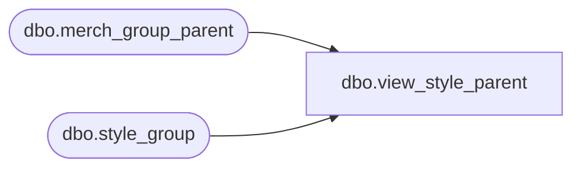

# dbo.view_style_parent

**Database:** me_01  
**Server:** bedrockdb02  

## Architecture Diagram



## Table Dependencies

| Referenced Table |
|---|
| dbo.merch_group_parent |
| dbo.style_group |

## View Code

```sql
create view dbo.view_style_parent 
         (style_id,
          hierarchy_level_id,
          hierarchy_group_id,
          parent_hierarchy_group_id)
AS
   SELECT s.style_id,
          h.hierarchy_level_id,
          h.hierarchy_group_id,
          h.parent_hierarchy_group_id
     FROM style_group s,
          merch_group_parent h
    where s.hierarchy_group_id = h.hierarchy_group_id
```

