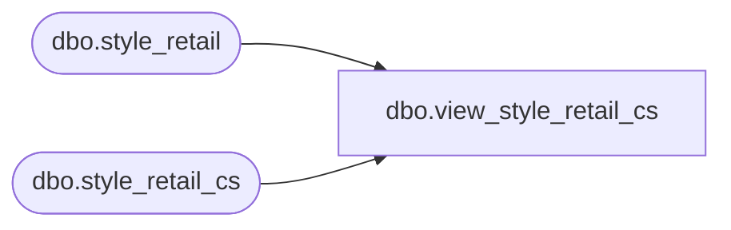

# dbo.view_style_retail_cs

**Database:** me_01  
**Server:** bedrockdb02  

## Architecture Diagram



## Table Dependencies

| Referenced Table |
|---|
| dbo.style_retail |
| dbo.style_retail_cs |

## View Code

```sql
create view dbo.view_style_retail_cs 
AS
SELECT [style_retail_id]
      ,[style_id]
      ,[jurisdiction_id]
      ,[compare_at_retail]
      ,[original_valuation_retail]
      ,[original_selling_retail]
      ,[original_price_status_id]
      ,[current_valuation_retail]
      ,[current_selling_retail]
      ,[current_price_status_id]
      ,[mix_match_rule_id1]
      ,[mix_match_rule_id2]
      ,[mix_match_rule_id3]
      ,[mix_match_rule_id4]
  FROM [style_retail]
UNION ALL
SELECT [style_retail_id]
      ,[style_id]
      ,[jurisdiction_id]
      ,[compare_at_retail]
      ,[original_valuation_retail]
      ,[original_selling_retail]
      ,[original_price_status_id]
      ,[current_valuation_retail]
      ,[current_selling_retail]
      ,[current_price_status_id]
      ,[mix_match_rule_id1]
      ,[mix_match_rule_id2]
      ,[mix_match_rule_id3]
      ,[mix_match_rule_id4]
  FROM [style_retail_cs]
```

