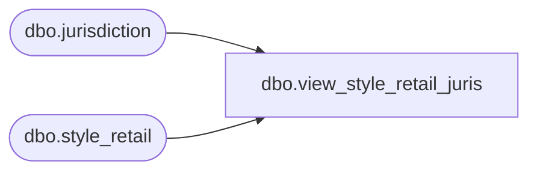

# dbo.view_style_retail_juris

**Database:** me_01  
**Server:** bedrockdb02  

## Architecture Diagram



## Table Dependencies

| Referenced Table |
|---|
| dbo.jurisdiction |
| dbo.style_retail |

## View Code

```sql
create view dbo.view_style_retail_juris 

AS

SELECT
	sr.style_retail_id,
	sr.style_id,
	sr.jurisdiction_id,
	j.jurisdiction_code,
	j.jurisdiction_description
FROM
	style_retail sr
INNER JOIN jurisdiction j ON sr.jurisdiction_id = j.jurisdiction_id
```

