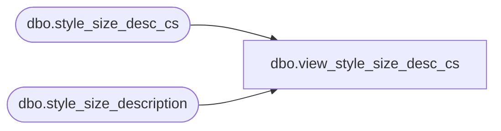

# dbo.view_style_size_desc_cs

**Database:** me_01  
**Server:** bedrockdb02  

## Architecture Diagram



## Table Dependencies

| Referenced Table |
|---|
| dbo.style_size_desc_cs |
| dbo.style_size_description |

## View Code

```sql
create view dbo.view_style_size_desc_cs 
AS
SELECT [style_size_description_id]
      ,[style_size_id]
      ,[language_id]
      ,[ticket_label_override]
  FROM [style_size_description]
UNION ALL
SELECT [style_size_description_id]
      ,[style_size_id]
      ,[language_id]
      ,[ticket_label_override]
  FROM [style_size_desc_cs]
```

