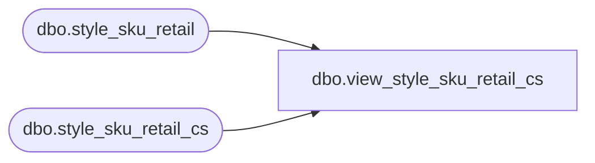

# dbo.view_style_sku_retail_cs

**Database:** me_01  
**Server:** bedrockdb02  

## Architecture Diagram



## Table Dependencies

| Referenced Table |
|---|
| dbo.style_sku_retail |
| dbo.style_sku_retail_cs |

## View Code

```sql
CREATE VIEW [dbo].[view_style_sku_retail_cs] 
AS
SELECT [style_sku_retail_id]
      ,[style_id]
      ,[sku_id]
      ,[jurisdiction_id]
      ,[original_selling_retail]
      ,[original_valuation_retail]
      ,[original_price_status_id]
      ,[current_selling_retail]
      ,[current_valuation_retail]
      ,[current_price_status_id]
  FROM [style_sku_retail]
UNION ALL
SELECT [style_sku_retail_id]
      ,[style_id]
      ,[sku_id]
      ,[jurisdiction_id]
      ,[original_selling_retail]
      ,[original_valuation_retail]
      ,[original_price_status_id]
      ,[current_selling_retail]
      ,[current_valuation_retail]
      ,[current_price_status_id]
  FROM [style_sku_retail_cs]
```

