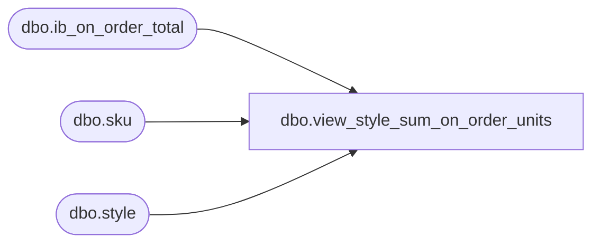

# dbo.view_style_sum_on_order_units

**Database:** me_01  
**Server:** bedrockdb02  

## Architecture Diagram



## Table Dependencies

| Referenced Table |
|---|
| dbo.ib_on_order_total |
| dbo.sku |
| dbo.style |

## View Code

```sql
create view dbo.view_style_sum_on_order_units 
         (style_id,
          total_on_order_units)
AS
   SELECT style.style_id,
          SUM(ib.total_on_order_units)
     FROM style,
          sku,
          ib_on_order_total ib
    WHERE style.style_id = sku.style_id
      AND sku.sku_id = ib.sku_id
    GROUP BY style.style_id
```

