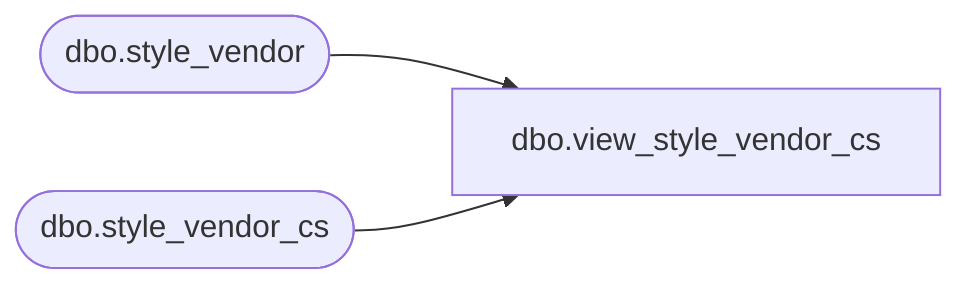

# dbo.view_style_vendor_cs

**Database:** me_01  
**Server:** bedrockdb02  

## Architecture Diagram



## Table Dependencies

| Referenced Table |
|---|
| dbo.style_vendor |
| dbo.style_vendor_cs |

## View Code

```sql
create view dbo.view_style_vendor_cs 
AS
SELECT [style_vendor_id]
      ,[style_id]
      ,[vendor_id]
      ,[vendor_style]
      ,[primary_vendor_flag]
      ,[current_cost]
      ,[currency_id]
  FROM [style_vendor]
UNION ALL
SELECT [style_vendor_id]
      ,[style_id]
      ,[vendor_id]
      ,[vendor_style]
      ,[primary_vendor_flag]
      ,[current_cost]
      ,[currency_id]
  FROM [style_vendor_cs]
```

