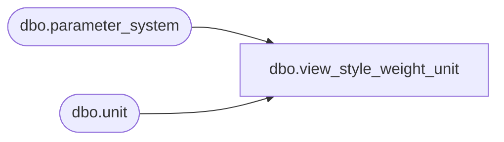

# dbo.view_style_weight_unit

**Database:** me_01  
**Server:** bedrockdb02  

## Architecture Diagram



## Table Dependencies

| Referenced Table |
|---|
| dbo.parameter_system |
| dbo.unit |

## View Code

```sql
create view dbo.view_style_weight_unit AS
select u.unit_code, u.unit_label from unit u, parameter_system ps
 where u.unit_id = ps.unit_weight_id
```

