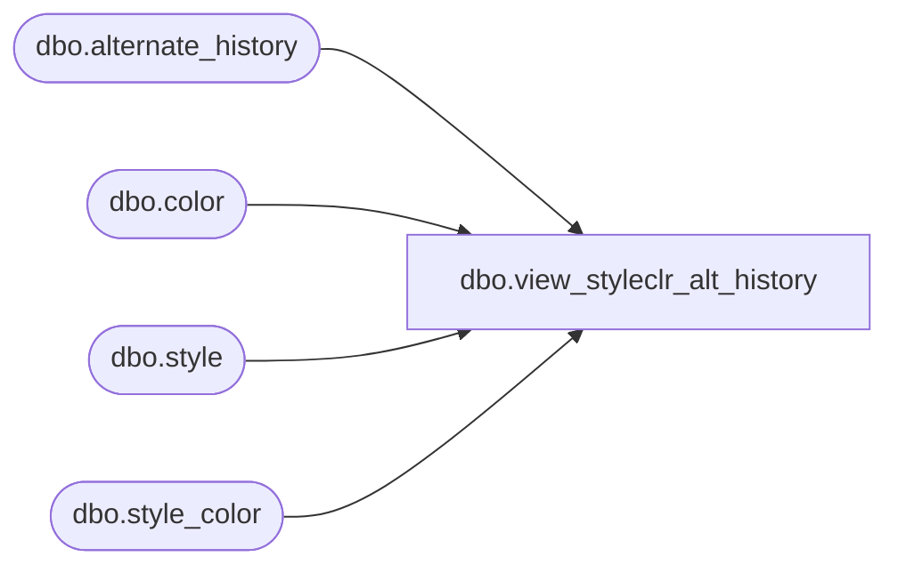

# dbo.view_styleclr_alt_history

**Database:** me_01  
**Server:** bedrockdb02  

## Architecture Diagram



## Table Dependencies

| Referenced Table |
|---|
| dbo.alternate_history |
| dbo.color |
| dbo.style |
| dbo.style_color |

## View Code

```sql
create view dbo.view_styleclr_alt_history AS
SELECT DISTINCT
  sc.style_color_id, 
  sc.style_id,
  s.style_code,
  s.long_desc,
  s.short_desc,
  sc.long_desc style_color_long_desc, 
  sc.short_desc style_color_short_desc,
  c.color_code,
  c.color_long_description,
  c.color_short_description
FROM  style s
INNER JOIN style_color sc
ON s.style_id = sc.style_id
INNER JOIN color c
ON sc.color_id = c.color_id
WHERE sc.style_color_id in (SELECT DISTINCT style_color_id FROM alternate_history)
```

