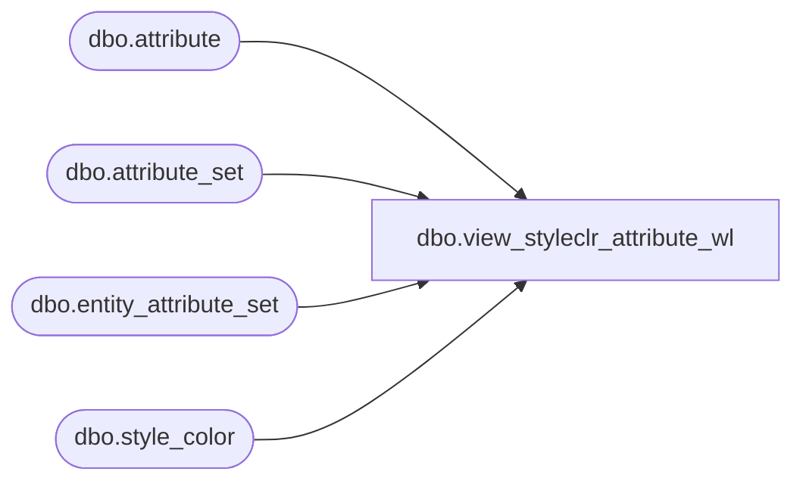

# dbo.view_styleclr_attribute_wl

**Database:** me_01  
**Server:** bedrockdb02  

## Architecture Diagram



## Table Dependencies

| Referenced Table |
|---|
| dbo.attribute |
| dbo.attribute_set |
| dbo.entity_attribute_set |
| dbo.style_color |

## View Code

```sql
create view dbo.view_styleclr_attribute_wl 
AS
SELECT 	DISTINCT
        sc.style_color_id,
	sc.style_id,
        sc.color_id,
	eas.attribute_set_id,
	eas.attribute_id,
	a.attribute_code, 
	a.attribute_label,
	ats.attribute_set_code,
	ats.attribute_set_label
FROM	style_color sc
LEFT OUTER JOIN entity_attribute_set eas ON (sc.style_color_id = eas.parent_id AND eas.parent_type = 19)
LEFT OUTER JOIN attribute a ON (eas.attribute_id = a.attribute_id)
LEFT OUTER JOIN attribute_set ats ON (eas.attribute_set_id = ats.attribute_set_id)
```

