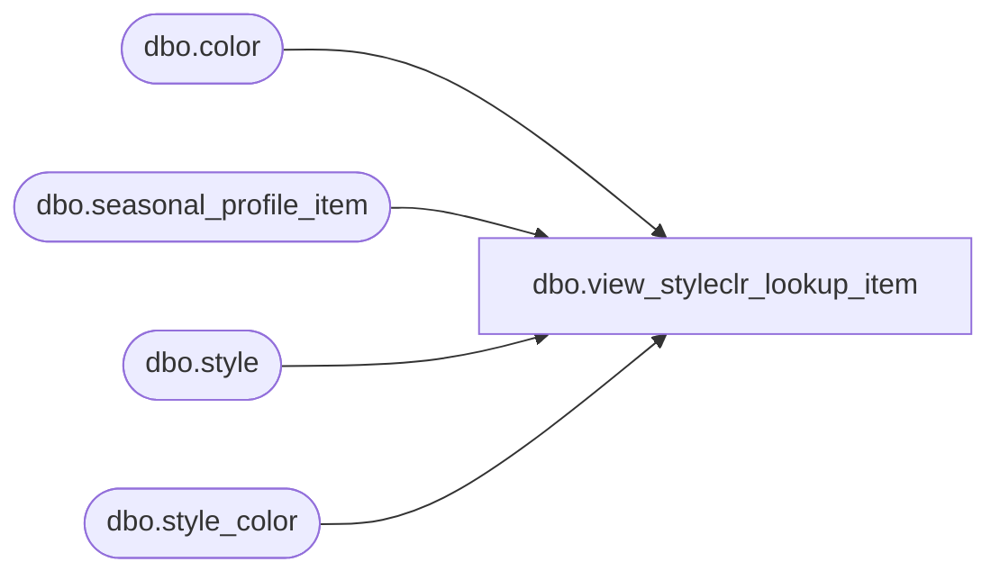

# dbo.view_styleclr_lookup_item

**Database:** me_01  
**Server:** bedrockdb02  

## Architecture Diagram



## Table Dependencies

| Referenced Table |
|---|
| dbo.color |
| dbo.seasonal_profile_item |
| dbo.style |
| dbo.style_color |

## View Code

```sql
create view dbo.view_styleclr_lookup_item AS
SELECT sc.style_color_id, s.style_code + N' - ' + s.long_desc + N' - ' + c.color_long_description 'style_color_label'
FROM style s
INNER JOIN style_color sc ON (s.style_id = sc.style_id)
INNER JOIN color c ON (sc.color_id = c.color_id)
WHERE s.active_flag = 1
AND c.active_flag = 1
AND sc.style_color_id not in (select distinct ISNULL(style_color_id,0) from seasonal_profile_item)
```

