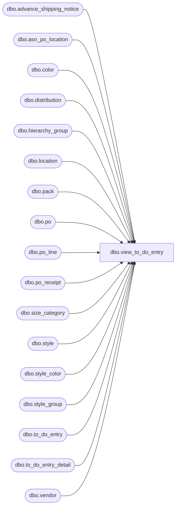

# dbo.view_to_do_entry

**Database:** me_01  
**Server:** bedrockdb02  

## Architecture Diagram



## Table Dependencies

| Referenced Table |
|---|
| dbo.advance_shipping_notice |
| dbo.asn_po_location |
| dbo.color |
| dbo.distribution |
| dbo.hierarchy_group |
| dbo.location |
| dbo.pack |
| dbo.po |
| dbo.po_line |
| dbo.po_receipt |
| dbo.size_category |
| dbo.style |
| dbo.style_color |
| dbo.style_group |
| dbo.to_do_entry |
| dbo.to_do_entry_detail |
| dbo.vendor |

## View Code

```sql
CREATE  view [dbo].[view_to_do_entry]
AS

SELECT  t.to_do_entry_id,
 		t.po_line_id,
 		t.po_shipment_id,
		t.location_id,
 		t.style_color_id,
		t.pack_id,
		t.asn_po_location_id,
		t.po_receipt_id,
		t.document_source,
		l.location_code,
		l.location_name,
		t.receipt_date,
		p.pack_code,
		p.pack_description,
		p.pack_short_description,
		p.pack_type,
		p.pack_status,
		p.vendor_pack_code,
		p.active_flag,
		p.vendor_upc_flag,
		s.style_code,
		s.long_desc AS style_description,
		c.color_code,
		c.color_long_description,
		c.color_short_description,
		sc.long_desc AS style_color_description,
		sc.short_desc AS style_color_short_description,
		sc.fashion_flag,
		sc.reorder_flag,
		COALESCE (scat.size_category_code, sicat.size_category_code) AS size_category_code,
		pl.line_no,
		pl.repeat_order_flag,
		pl.store_pack_flag,
		po.po_id,
		po.po_no,
		COALESCE (po.po_description, N' ') AS po_description,
		po.po_status,
		po.approval_status,
		po.vendor_id,
		COALESCE (po.blanket_po_number, N' ') AS blanket_po_number,
		po.split_release_po_flag,
		NULL AS advance_shipping_notice_id,
		NULL AS asn_no,
		NULL AS shipment_ref_no,
		NULL AS po_receipt_no,
		t.request_type,
		dp.distribution_number parent_distribution_number,
		dr.distribution_number  root_distribution_number,
		COALESCE (sc.style_id, p.style_id) style_id,
		COALESCE (hg1.hierarchy_group_id, hg2.hierarchy_group_id) hierarchy_group_id,
		COALESCE (hg1.hierarchy_group_code, hg2.hierarchy_group_code) AS hierarchy_group_code,
		COALESCE (hg1.hierarchy_group_short_label, hg2.hierarchy_group_short_label) AS hierarchy_group_short_label,
		COALESCE (hg1.hierarchy_group_label, hg2.hierarchy_group_label) AS hierarchy_group_label,
		COALESCE (COALESCE (t.po_line_total_units, std.sum_units), 0) total_units,
		v.supports_store_pack
FROM    to_do_entry t
		INNER JOIN  po po
			ON (t.po_id = po.po_id)
		RIGHT JOIN vendor v on v.vendor_id = po.vendor_id
		LEFT OUTER JOIN po_line pl
			ON (t.po_line_id = pl.po_line_id AND t.po_id = pl.po_id AND po.po_id = pl.po_id)
		LEFT OUTER JOIN distribution dp
			on (t.parent_distribution_id = dp.distribution_id)
		LEFT OUTER JOIN distribution dr
			on (t.root_distribution_id = dr.distribution_id)
		LEFT OUTER JOIN location l
			ON (t.location_id = l.location_id)
		LEFT OUTER JOIN (style_color sc
					INNER JOIN style s
					ON (sc.style_id = s.style_id)
					LEFT OUTER JOIN size_category scat
					ON (s.size_category_id = scat.size_category_id)
					INNER JOIN color c
					ON (sc.color_id = c.color_id)
					INNER JOIN style_group sg1
					ON (sc.style_id = sg1.style_id AND sg1.main_group_flag = 1)
					INNER JOIN hierarchy_group hg1
					ON (sg1.hierarchy_group_id = hg1.hierarchy_group_id))
					ON (t.style_color_id = sc.style_color_id)
		LEFT OUTER JOIN (pack p
					INNER JOIN style sty
					ON (p.style_id = sty.style_id)
					LEFT OUTER JOIN size_category sicat
					ON (sty.size_category_id = sicat.size_category_id)
					INNER JOIN style_group sg2
					ON (p.style_id = sg2.style_id AND sg2.main_group_flag = 1)
					INNER JOIN hierarchy_group hg2
					ON (sg2.hierarchy_group_id = hg2.hierarchy_group_id))
					ON (t.pack_id = p.pack_id)
		LEFT OUTER JOIN  (SELECT     td.to_do_entry_id, SUM(td.units) sum_units
            FROM          to_do_entry_detail td
                            GROUP BY td.to_do_entry_id) std ON (t.to_do_entry_id = std.to_do_entry_id)
WHERE     t.distribution_id IS NULL AND t.document_source IN (1, 2, 3, 14) AND (t.locked_flag = 0 OR DATEDIFF(minute, ISNULL(t.lock_timestamp, '20140101'), getdate()) > 30 )
UNION ALL
SELECT  t.to_do_entry_id,
 		t.po_line_id,
 		t.po_shipment_id,
		t.location_id,
 		t.style_color_id,
		t.pack_id,
		t.asn_po_location_id,
		t.po_receipt_id,
		t.document_source,
		l.location_code,
		l.location_name,
		t.receipt_date,
		p.pack_code,
		p.pack_description,
		p.pack_short_description,
		p.pack_type,
		p.pack_status,
		p.vendor_pack_code,
		p.active_flag,
		p.vendor_upc_flag,
		s.style_code,
		s.long_desc AS style_description,
		c.color_code,
		c.color_long_description,
		c.color_short_description,
		sc.long_desc AS style_color_description,
		sc.short_desc AS style_color_short_description,
		sc.fashion_flag,
		sc.reorder_flag,
		COALESCE (scat.size_category_code, sicat.size_category_code) AS size_category_code,
		pl.line_no,
		pl.repeat_order_flag,
		pl.store_pack_flag,
		po.po_id,
		po.po_no,
		COALESCE (po.po_description, N' ') AS po_description,
		po.po_status,
		po.approval_status,
		po.vendor_id,
		COALESCE (po.blanket_po_number, N' ') AS blanket_po_number,
		po.split_release_po_flag,
		asn.advance_shipping_notice_id,
		asn.document_no AS asn_no,
		asn.shipment_ref_no,
		NULL AS po_receipt_no,
		t.request_type,
		dp.distribution_number parent_distribution_number,
		dr.distribution_number  root_distribution_number,
		COALESCE (sc.style_id, p.style_id) style_id,
		COALESCE (hg1.hierarchy_group_id, hg2.hierarchy_group_id) hierarchy_group_id,
 		COALESCE (hg1.hierarchy_group_code, hg2.hierarchy_group_code) AS hierarchy_group_code,
		COALESCE (hg1.hierarchy_group_short_label, hg2.hierarchy_group_short_label) AS hierarchy_group_short_label,
		COALESCE (hg1.hierarchy_group_label, hg2.hierarchy_group_label) AS hierarchy_group_label,
		COALESCE (COALESCE (t.po_line_total_units,   std.sum_units), 0) total_units,
		v.supports_store_pack
FROM	to_do_entry t
		INNER JOIN po po
		ON (t.po_id = po.po_id)
		RIGHT JOIN vendor v on v.vendor_id = po.vendor_id
		LEFT OUTER JOIN po_line pl
		ON (t.po_line_id = pl.po_line_id AND t.po_id = pl.po_id AND po.po_id = pl.po_id)
		LEFT OUTER JOIN distribution dp
			on (t.parent_distribution_id = dp.distribution_id)
		LEFT OUTER JOIN distribution dr
			on (t.root_distribution_id = dr.distribution_id)
		INNER JOIN asn_po_location apl
		ON (t.asn_po_location_id = apl.asn_po_location_id
		   AND t.po_id = apl.po_id
		   AND po.po_id = apl.po_id)
		INNER JOIN  advance_shipping_notice asn
		ON (apl.advance_shipping_notice_id = asn.advance_shipping_notice_id)
		LEFT OUTER JOIN location l
		ON (t.location_id = l.location_id)
		LEFT OUTER JOIN (	style_color sc
							INNER JOIN style s
							ON (sc.style_id = s.style_id)
							LEFT OUTER JOIN size_category scat
							ON (s.size_category_id = scat.size_category_id)
							INNER JOIN color c
							ON (sc.color_id = c.color_id)
							INNER JOIN style_group sg1
							ON (sc.style_id = sg1.style_id AND sg1.main_group_flag = 1)
							INNER JOIN hierarchy_group hg1
							ON (sg1.hierarchy_group_id = hg1.hierarchy_group_id))
		ON (t.style_color_id = sc.style_color_id)
		LEFT OUTER JOIN (	pack p
							INNER JOIN style sty
							ON (p.style_id = sty.style_id)
							LEFT OUTER JOIN size_category sicat
							ON (sty.size_category_id = sicat.size_category_id)
							INNER JOIN style_group sg2
							ON (p.style_id = sg2.style_id AND sg2.main_group_flag = 1)
							INNER JOIN hierarchy_group hg2
							ON (sg2.hierarchy_group_id = hg2.hierarchy_group_id))
		ON (t.pack_id = p.pack_id)
		LEFT OUTER JOIN (SELECT		td.to_do_entry_id,
			 	   					SUM(td.units) sum_units
       					FROM        to_do_entry_detail td
                        GROUP BY	td.to_do_entry_id) std
		ON (t.to_do_entry_id = std.to_do_entry_id)
WHERE	t.distribution_id IS NULL
		AND t.document_source = 4 AND (t.locked_flag = 0 OR DATEDIFF(minute, ISNULL(t.lock_timestamp, '20140101'), getdate()) > 30 )
UNION ALL
SELECT  t.to_do_entry_id,
 		t.po_line_id,
 		t.po_shipment_id,
		t.location_id,
 		t.style_color_id,
		t.pack_id,
		t.asn_po_location_id,
		t.po_receipt_id,
		t.document_source,
		l.location_code,
		l.location_name,
		t.receipt_date,
		p.pack_code,
		p.pack_description,
		p.pack_short_description,
		p.pack_type,
		p.pack_status,
		p.vendor_pack_code,
		p.active_flag,
		p.vendor_upc_flag,
		s.style_code,
		s.long_desc AS style_description,
		c.color_code,
		c.color_long_description,
		c.color_short_description,
		sc.long_desc AS style_color_description,
		sc.short_desc AS style_color_short_description,
		sc.fashion_flag,
		sc.reorder_flag,
		COALESCE (scat.size_category_code, sicat.size_category_code) AS size_category_code,
		pl.line_no,
		pl.repeat_order_flag,
		pl.store_pack_flag,
		po.po_id,
		po.po_no,
		COALESCE (po.po_description, N' ') AS po_description,
		po.po_status,
		po.approval_status,
		po.vendor_id,
		COALESCE (po.blanket_po_number, N' ') AS blanket_po_number,
		po.split_release_po_flag,
		NULL AS advance_shipping_notice_id,
		NULL AS asn_no,
		NULL AS shipment_ref_no,
		por.document_no AS po_receipt_no,
		t.request_type,
		dp.distribution_number parent_distribution_number,
		dr.distribution_number  root_distribution_number,
		COALESCE (sc.style_id, p.style_id) style_id,
		COALESCE (hg1.hierarchy_group_id, hg2.hierarchy_group_id) hierarchy_group_id,
		COALESCE (hg1.hierarchy_group_code, hg2.hierarchy_group_code) AS hierarchy_group_code,
		COALESCE (hg1.hierarchy_group_short_label, hg2.hierarchy_group_short_label) AS hierarchy_group_short_label,
		COALESCE (hg1.hierarchy_group_label, hg2.hierarchy_group_label) AS hierarchy_group_label,
		COALESCE (COALESCE (t.po_line_total_units,  std.sum_units), 0) total_units,
		v.supports_store_pack
FROM	to_do_entry t
		INNER JOIN po po
		ON (t.po_id = po.po_id)
		RIGHT JOIN vendor v on v.vendor_id = po.vendor_id
		LEFT OUTER JOIN po_line pl
		ON (t.po_line_id = pl.po_line_id AND t.po_id = pl.po_id AND po.po_id = pl.po_id)
		LEFT OUTER JOIN distribution dp
			on (t.parent_distribution_id = dp.distribution_id)
		LEFT OUTER JOIN distribution dr
			on (t.root_distribution_id = dr.distribution_id)
		LEFT OUTER JOIN po_receipt por
		ON (t.po_receipt_id = por.po_receipt_id)
		LEFT OUTER JOIN location l
		ON (t.location_id = l.location_id)
		LEFT OUTER JOIN (	style_color sc
							INNER JOIN style s
							ON (sc.style_id = s.style_id)
							LEFT OUTER JOIN size_category scat
							ON (s.size_category_id = scat.size_category_id)
							INNER JOIN color c
							ON (sc.color_id = c.color_id)
							INNER JOIN style_group sg1
							ON (sc.style_id = sg1.style_id AND sg1.main_group_flag = 1)
							INNER JOIN hierarchy_group hg1
							ON (sg1.hierarchy_group_id = hg1.hierarchy_group_id))
		ON (t.style_color_id = sc.style_color_id)
		LEFT OUTER JOIN (	pack p
							INNER JOIN style sty
							ON (p.style_id = sty.style_id)
							LEFT OUTER JOIN size_category sicat
							ON (sty.size_category_id = sicat.size_category_id)
							INNER JOIN style_group sg2
							ON (p.style_id = sg2.style_id AND sg2.main_group_flag = 1)
							INNER JOIN hierarchy_group hg2
							ON (sg2.hierarchy_group_id = hg2.hierarchy_group_id))
		ON (t.pack_id = p.pack_id)
		LEFT OUTER JOIN (SELECT		to_do_entry_id,
			 	   					SUM(units) sum_units
       					FROM        to_do_entry_detail
                        GROUP BY	to_do_entry_id) std
		ON (t.to_do_entry_id = std.to_do_entry_id)
WHERE	t.distribution_id IS NULL
		AND t.document_source = 5 AND (t.locked_flag = 0 OR DATEDIFF(minute, ISNULL(t.lock_timestamp, '20140101'), getdate()) > 30 )
```

