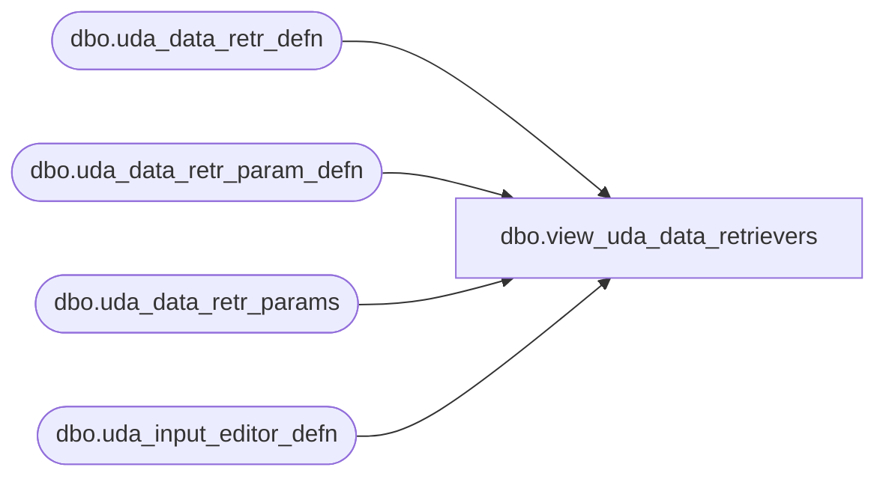

# dbo.view_uda_data_retrievers

**Database:** me_01  
**Server:** bedrockdb02  

## Architecture Diagram



## Table Dependencies

| Referenced Table |
|---|
| dbo.uda_data_retr_defn |
| dbo.uda_data_retr_param_defn |
| dbo.uda_data_retr_params |
| dbo.uda_input_editor_defn |

## View Code

```sql
CREATE View [dbo].[view_uda_data_retrievers] as
SELECT r.name as retriever_name, p.property, t.data_retriever_id, t.param_id, r.data_type as retriever_data_type, p.data_type as param_data_type, t.optional, p.[sequence], i.typename as user_input_type
                                    FROM uda_data_retr_defn r 
                                    left JOIN uda_data_retr_params t ON r.data_retriever_id = t.data_retriever_id
                                    left JOIN uda_data_retr_param_defn p ON t.param_id=p.param_id
                                    left JOIN uda_input_editor_defn i ON i.editor_id=t.input_editor_id
```

