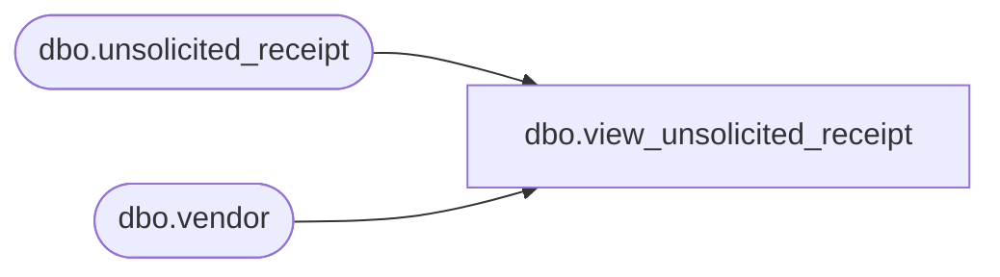

# dbo.view_unsolicited_receipt

**Database:** me_01  
**Server:** bedrockdb02  

## Architecture Diagram



## Table Dependencies

| Referenced Table |
|---|
| dbo.unsolicited_receipt |
| dbo.vendor |

## View Code

```sql
create view dbo.view_unsolicited_receipt 
         (doc_type,
          doc_no,
          from_location_id,
          to_location_id,
          create_date,
          receive_date,
          status,
          description,
          doc_id,
          display_location_id,
          grouping_label,
          secondary_type,
          vendor_code,
          vendor_name,
          transaction_reason_id,
          performed_by,
          cartons_arrived, 
          total_cartons,
          match_status,
          shipment_ref_no)
AS
   SELECT N'Unsolicited receipt',
          unsolicited_receipt.document_no,
          CAST(null AS smallint),
          unsolicited_receipt.location_id,
	  convert(smalldatetime,convert(char(12),create_date,109)),
	  convert(smalldatetime,convert(char(12),receive_date,109)),
          unsolicited_receipt.document_status,
          unsolicited_receipt.document_description,
          unsolicited_receipt.unsolicited_receipt_id,
          unsolicited_receipt.location_id,
          unsolicited_receipt.grouping_label,
          0,
          vendor.vendor_code,
          vendor.vendor_name,
          unsolicited_receipt.transaction_reason_id,
          unsolicited_receipt.performed_by,
          CAST(null AS int),
          CAST(null AS int),
          unsolicited_receipt.match_status,
         CAST(null AS nvarchar(30))
     FROM dbo.unsolicited_receipt,
          dbo.vendor
    WHERE unsolicited_receipt.vendor_id = vendor.vendor_id
```

