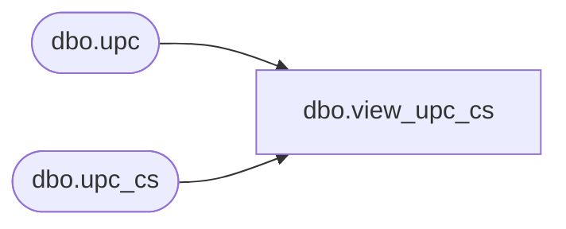

# dbo.view_upc_cs

**Database:** me_01  
**Server:** bedrockdb02  

## Architecture Diagram



## Table Dependencies

| Referenced Table |
|---|
| dbo.upc |
| dbo.upc_cs |

## View Code

```sql
create view dbo.view_upc_cs 
AS
SELECT [upc_id]
      ,[sku_id]
      ,[pack_id]
      ,[upc_type]
      ,[upc_number]
      ,[activation_date]
      ,[last_activity_date]
  FROM [upc]
UNION ALL
SELECT [upc_id]
      ,[sku_id]
      ,[pack_id]
      ,[upc_type]
      ,[upc_number]
      ,[activation_date]
      ,[last_activity_date]
  FROM [upc_cs]
```

