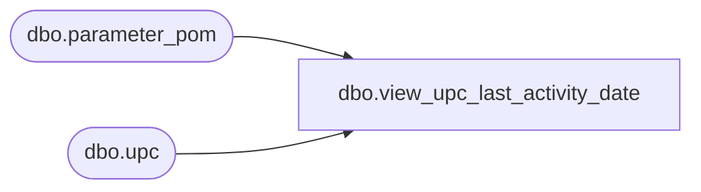

# dbo.view_upc_last_activity_date

**Database:** me_01  
**Server:** bedrockdb02  

## Architecture Diagram



## Table Dependencies

| Referenced Table |
|---|
| dbo.parameter_pom |
| dbo.upc |

## View Code

```sql
CREATE VIEW dbo.view_upc_last_activity_date 
AS
SELECT a.sku_id, a.upc_type, MAX(b.upc_number) upc_number, a.last_activity_date
FROM upc b,
(SELECT sku_id, upc.upc_type, MAX(upc.last_activity_date) last_activity_date
 FROM upc
       INNER JOIN parameter_pom pp
       ON upc.upc_type = pp.upc_type
 GROUP BY sku_id, upc.upc_type) a
WHERE a.sku_id=b.sku_id
AND a.last_activity_date = b.last_activity_date
AND a.upc_type = b.upc_type
GROUP BY a.sku_id, a.upc_type, a.last_activity_date
```

