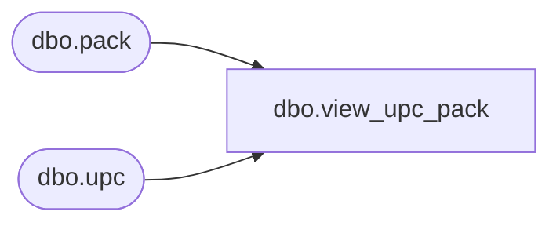

# dbo.view_upc_pack

**Database:** me_01  
**Server:** bedrockdb02  

## Architecture Diagram



## Table Dependencies

| Referenced Table |
|---|
| dbo.pack |
| dbo.upc |

## View Code

```sql
create view dbo.view_upc_pack 


AS
SELECT
	pack.pack_id,
	MIN (upc.upc_number) upc_number
FROM
	pack
LEFT OUTER JOIN	upc ON pack.pack_id = upc.pack_id
GROUP BY
	pack.pack_id
```

